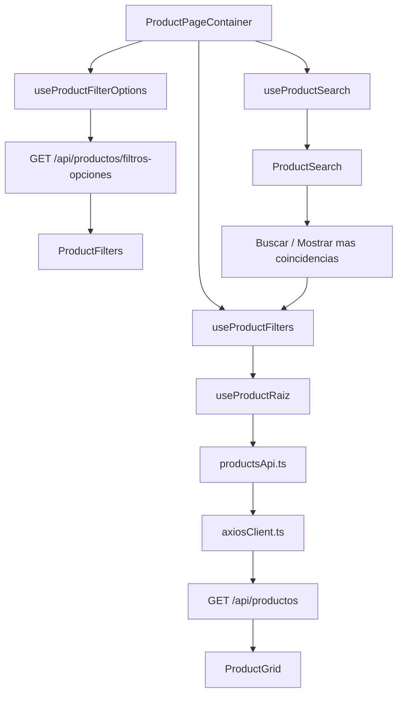

# CONTINUIDAD FILTROS Y CATALOGO

## OBJETIVO

Este documento resume lo trabajado para poder retomarlo despues sin volver a revisar todo desde cero.

Si manana se retoma la tarea, leer primero este archivo.

## ESTADO ACTUAL

El catalogo principal ya carga productos desde la API publica:

```txt
GET /api/productos?page=1&limit=12
```

Tambien puede filtrar por:

- `search`
- `categoria_id`
- `marca`
- `modelo`
- `tipo_producto`
- `condicion`
- `anio_min`
- `anio_max`
- `precio_min`
- `precio_max`
- `disponibilidad`

No se usa `stock` en el frontend publico.

## FLUJO GENERAL



## ARCHIVOS PRINCIPALES

| Archivo | Que hace |
| --- | --- |
| `features/products/hooks/useProductRaiz.ts` | Hook raiz interno para consultar `/api/productos`. |
| `features/products/hooks/useProductFilters.ts` | Maneja filtros aplicados, pagina, limpiar filtros y consulta filtrada. |
| `features/products/hooks/useProductSearch.ts` | Maneja barra de busqueda y sugerencias. Al buscar, aplica `search` al catalogo. |
| `features/products/hooks/useProductFilterOptions.ts` | Carga opciones de filtros desde `/api/productos/filtros-opciones`. |
| `features/products/api/productsApi.ts` | Construye rutas y consulta productos/opciones. |
| `features/products/utils/productAdapter.ts` | Convierte `ProductApiItem` al `Product` usado por cards actuales. |
| `features/products/utils/productImage.ts` | Optimiza URLs de imagen para sugerencias y catalogo. |
| `components/compartidos/productos/ProductPageContainer.tsx` | Une busqueda, filtros, opciones y grilla. |
| `components/compartidos/productos/ProductFilters.tsx` | Panel de filtros desktop/movil. |
| `components/compartidos/productos/ProductGrid.tsx` | Grilla compartida y paginador. |
| `components/movil/layout/MobileAppChrome.tsx` | Pasa filtros al drawer movil. |
| `components/movil/productos/MobileFilterDrawer.tsx` | Contenedor visual del filtro movil. |

## BUSQUEDA

La barra de busqueda tiene sugerencias.

Cuando el usuario presiona:

- `Buscar`
- `Mostrar mas coincidencias`

se llama a `onSearchSubmit(search)` y eso ejecuta:

```txt
productFilters.applyFilters({
  ...productFilters.filters,
  search
})
```

Resultado:

```txt
GET /api/productos?search=texto&page=1&limit=12
```

## FILTROS

`ProductFilters` recibe:

```tsx
filterOptions={filterOptions}
filters={productFilters.filters}
onApplyFilters={productFilters.applyFilters}
onClearFilters={productFilters.clearFilters}
```

Al presionar `Aplicar filtros`, se consulta la API con los params seleccionados.

Al presionar `Limpiar filtros`, vuelve a:

```txt
GET /api/productos?page=1&limit=12
```

## COMBOS

Los combos de:

- categoria
- marca
- modelo
- tipo de producto
- anio minimo
- anio maximo

usan un combo custom con scroll interno.

Esto evita que en movil la lista ocupe toda la pantalla.

```txt
max-h-48 md:max-h-60
```

## ANIOS

Los anios vienen de:

```txt
GET /api/productos/filtros-opciones
```

Reglas:

- `anio_min` es seleccionable desde el combo.
- `anio_max` se activa solo si existe `anio_min`.
- `anio_max` solo permite anios superiores al minimo.
- Si solo se selecciona `anio_min`, es valido.

Ejemplo:

```txt
GET /api/productos?anio_min=2018&page=1&limit=12
```

## PRECIO

El rango de precio usa una sola barra.

Reglas:

- Por defecto controla `precio_min`.
- Si el valor esta en `0`, no se manda precio.
- Al elegir minimo, se activa el campo de maximo.
- Al hacer clic en maximo, la misma barra controla `precio_max`.
- En modo maximo, la barra se marca naranja.
- `precio_max` no puede ser menor o igual que `precio_min`.
- Si solo se elige minimo, es valido.

## CATEGORIAS Y COLORES

La API ahora devuelve:

```json
{
  "categoria_nombre": "Motor",
  "color_hex": "#4F46E5",
  "color_texto_hex": "#FFFFFF"
}
```

El adaptador lo convierte a:

```ts
category
categoryColor
categoryTextColor
```

Las cards usan esos colores para la etiqueta de categoria.

Si no vienen colores, usan fallback local.

## IMAGENES

Los productos usan `imagen_principal`.

Para no consumir muchos datos, se optimiza con:

```txt
w=420
h=315
fit=crop
auto=format
q=45
```

Archivo:

```txt
features/products/utils/productImage.ts
```

## PAGINACION

`ProductGrid` recibe:

```tsx
pagination={productFilters.pagination}
onPageChange={productFilters.changePage}
```

Muestra:

- total de productos
- botones de pagina
- anterior
- siguiente

No muestra `limit`.

Al cambiar pagina conserva los filtros activos.

## VERIFICACIONES HECHAS

Se ejecutaron:

```txt
pnpm.cmd lint
pnpm.cmd exec tsc --noEmit
```

Ambos pasaron despues de los cambios.

## PENDIENTES RECOMENDADOS

1. Revisar UX final del filtro de precio en movil.
2. Agregar cierre del combo al hacer clic fuera, si se vuelve necesario.
3. Revisar si `CategoryStrip` debe cargar categorias desde endpoint propio de categorias.
4. Conectar categorias destacadas con `categoria_id` para filtrar al hacer clic.
5. Revisar documentacion vieja que aun mencione `useProducts.ts`; ahora el hook raiz se llama `useProductRaiz.ts`.

## FRASE PARA RETOMAR

Cuando se retome:

```txt
Lee documentacion/CONTINUIDAD_FILTROS_CATALOGO.md y continuemos desde ahi.
```

