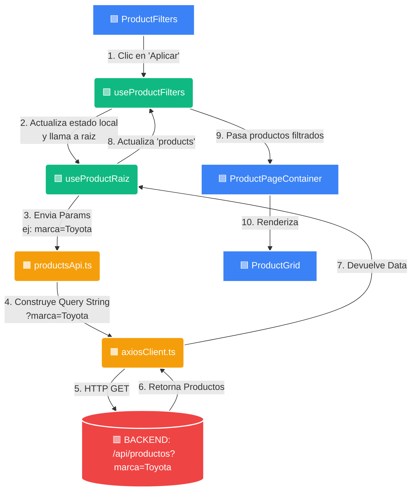
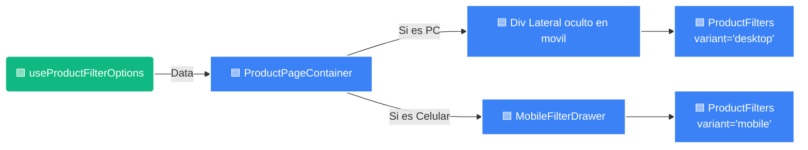

# 🎨 GUÍA VISUAL DEFINITIVA DE FILTRACIÓN

> Guía completa y exhaustiva del sistema de filtros del catálogo, diseñada de forma visual para entender todo el flujo sin leer bloques de texto.

> **Código de Colores en los Diagramas:**
> 🟦 **Azul:** Componentes Visuales (UI / Pantallas)
> 🟩 **Verde:** Hooks (Lógica y Estado en React)
> 🟧 **Naranja:** API y Clientes (Conexión a internet)
> 🟥 **Rojo:** Backend (Servidor / BD)
> 🟪 **Morado:** Context Providers (Estado Global UI)

## 📑 ÍNDICE
- [🎨 GUÍA VISUAL DEFINITIVA DE FILTRACIÓN](#-guía-visual-definitiva-de-filtración)
  - [📑 ÍNDICE](#-índice)
  - [1. Rutas de API Utilizadas](#1-rutas-de-api-utilizadas)
  - [2. Parámetros y Reglas de Filtrado](#2-parámetros-y-reglas-de-filtrado)
  - [3. Estructura Completa de Archivos](#3-estructura-completa-de-archivos)
  - [2. Flujo 1: ¿De dónde salen las opciones del filtro?](#2-flujo-1-de-dónde-salen-las-opciones-del-filtro)
  - [3. Flujo 2: ¿Qué pasa al hacer clic en "Aplicar Filtros"?](#3-flujo-2-qué-pasa-al-hacer-clic-en-aplicar-filtros)
  - [4. Diferencia Visual: Desktop vs Móvil](#4-diferencia-visual-desktop-vs-móvil)
    - [📌 Resumen para Replicar:](#-resumen-para-replicar)

---

## 1. Rutas de API Utilizadas

El frontend se comunica exclusivamente con estas dos rutas para hacer funcionar los filtros:

| Método | Endpoint | ¿Para qué sirve? | Dónde se llama |
|---|---|---|---|
| **GET** | `/api/productos/filtros-opciones` | Trae las listas para llenar los selects (marcas, modelos, años, categorías, etc). | `productsApi.getProductFilterOptions` |
| **GET** | `/api/productos?marca=Toyota&page=1` | Trae los productos finales según los filtros aplicados en la URL. | `productsApi.getProductsByQueryString` |

---

## 2. Parámetros y Reglas de Filtrado

Estos son los campos (`ProductListParams`) que el sistema reconoce y envía al backend. 

| Parámetro | Tipo UI | Regla de Negocio Front |
|---|---|---|
| `search` | 🟦 Input Texto | Aplica si el usuario busca algo. Se envía junto con el resto de filtros. |
| `categoria_id` | 🟦 Select custom / Cards | Reemplaza a las cards de categorías destacadas. |
| `marca` | 🟦 Select custom | Altura máxima visual: `max-h-48 md:max-h-60`. |
| `modelo` | 🟦 Select custom | Igual que marca. |
| `tipo_producto` | 🟦 Select custom | Tipo de repuesto/producto. |
| `condicion` | 🟦 Radio Buttons | Ej: "Nuevo", "Usado". |
| `disponibilidad` | 🟦 Radio Buttons | Ej: "En stock", "A pedido". |
| `anio_min` | 🟦 Select custom | Es seleccionable desde el combo libremente. |
| `anio_max` | 🟦 Select custom | ⚠️ **Solo se activa si existe `anio_min`**. Solo permite años superiores al mínimo. |
| `precio_min` | 🟦 Rango (1 barra) | Por defecto controla el mínimo. Si es 0, no se envía. |
| `precio_max` | 🟦 Rango (1 barra) | ⚠️ **Se activa al elegir el mínimo**. La barra se vuelve naranja y no puede ser menor al mínimo. |
| `page` / `limit` | 🟦 Paginador | Conservan los filtros al cambiar de página. Limit suele ser 12. |

> **Nota:** El parámetro `stock` NO se usa como filtro en el frontend público.

---

## 3. Estructura Completa de Archivos

Esta es la anatomía exacta de cómo están distribuidos los archivos relacionados a la filtración en el proyecto:

```text
📦 frontend
 ┣ 📂 app
 ┃ ┣ 📜 page.tsx                       (Ruta / -> Llama a ProductPageContainer)
 ┃ ┗ 📂 productos
 ┃   ┗ 📜 page.tsx                     (Ruta /productos -> Llama al mismo Container)
 ┣ 📂 components
 ┃ ┣ 📂 compartidos/productos
 ┃ ┃ ┣ 🟦 ProductPageContainer.tsx     (PADRE: Instancia hooks y reparte data)
 ┃ ┃ ┣ 🟦 ProductFilters.tsx           (UI Mudo: Recibe data y dibuja form)
 ┃ ┃ ┗ 🟦 ProductGrid.tsx              (UI Mudo: Recibe productos y dibuja Grid)
 ┃ ┣ 📂 movil/layout
 ┃ ┃ ┣ 🟪 MobileFilterContext.tsx      (Provider que abre/cierra el panel móvil)
 ┃ ┃ ┗ � MobileAppChrome.tsx          (Estructura base del celular)
 ┃ ┗ �📂 movil/productos
 ┃   ┗ 🟦 MobileFilterDrawer.tsx       (Contenedor físico del panel lateral móvil)
 ┣ 📂 features/products
 ┃ ┣ 📂 api
 ┃ ┃ ┗ 🟧 productsApi.ts               (Convierte params a URL y llama a axios)
 ┃ ┣ 📂 hooks
 ┃ ┃ ┣ 🟩 useProductFilterOptions.ts   (Trae la metadata: opciones de filtro)
 ┃ ┃ ┣ 🟩 useProductFilters.ts         (Maneja estado del formulario y aplica)
 ┃ ┃ ┣ 🟩 useProductSearch.ts          (Maneja la barra de búsqueda y sugerencias)
 ┃ ┃ ┗ � useProductRaiz.ts            (Pide productos reales al Backend)
 ┃ ┗ �📂 types
 ┃   ┣ 📜 product.types.ts             (Define Product, ProductListParams, etc.)
 ┃   ┗ 📜 productFilterOptions.types.ts(Define ProductFilterOptionsModel)
 ┗ 📂 lib
   ┗ 🟧 axiosClient.ts                 (Fetch base que une baseUrl + queryString)
```

---

## 2. Flujo 1: ¿De dónde salen las opciones del filtro?
*(Cómo se llenan los Selects de Marcas, Categorías, Años, etc. al cargar la página)*

```mermaid
flowchart TD
  %% Estilos de colores
  classDef ui fill:#3b82f6,stroke:#fff,stroke-width:2px,color:#fff;
  classDef hook fill:#10b981,stroke:#fff,stroke-width:2px,color:#fff;
  classDef api fill:#f59e0b,stroke:#fff,stroke-width:2px,color:#fff;
  classDef backend fill:#ef4444,stroke:#fff,stroke-width:2px,color:#fff;

  A[🟦 ProductPageContainer]:::ui -->|1. Llama al hook| B(🟩 useProductFilterOptions):::hook
  B -->|2. Pide opciones| C(🟧 productsApi.ts):::api
  C -->|3. get()| D(🟧 axiosClient.ts):::api
  D -->|4. HTTP GET| E[(🟥 BACKEND: \n /api/productos/filtros-opciones)]:::backend
  E -->|5. Retorna JSON| D
  D -->|6. Pasa la data| B
  B -->|7. Entrega 'filterOptions'| A
  A -->|8. Pasa props a la UI| F[🟦 ProductFilters]:::ui
  F -.->|Dibuja| G((Select Marcas, Categorías...))
```

---

## 3. Flujo 2: ¿Qué pasa al hacer clic en "Aplicar Filtros"?
*(El usuario eligió "Toyota", "2018" y presionó Aplicar)*



---

## 4. Diferencia Visual: Desktop vs Móvil
*(El código es reciclable. El mismo filtro se usa en Computadora y Celular, solo cambia quién lo envuelve)*



### 📌 Resumen para Replicar:
1. Crea un **Hook** (`useProductFilterOptions`) que traiga listas (marcas, modelos) al iniciar.
2. Crea un **Componente UI** (`ProductFilters`) mudo, que solo dibuje selects usando la data del hook anterior.
3. Crea un **Hook** (`useProductFilters` / `useProductRaiz`) que maneje un estado (ej: `{ marca: 'Toyota' }`) y pida los productos.
4. Crea un **Contenedor** (`ProductPageContainer`) que una todo: Le pasa los filtros a la UI, y la respuesta al Grid de productos.