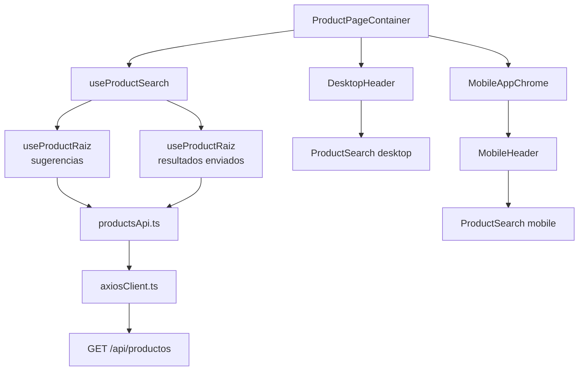
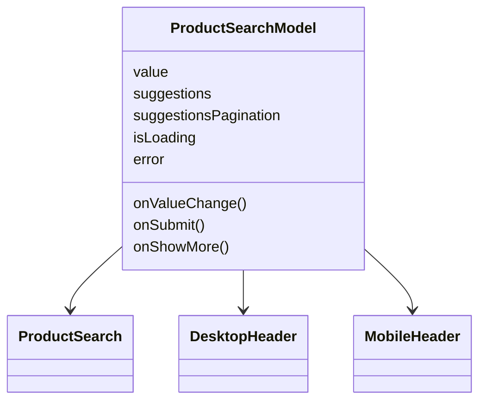
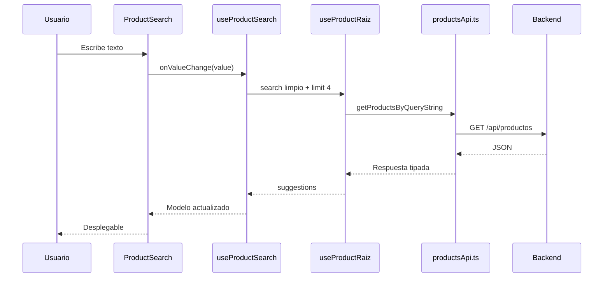
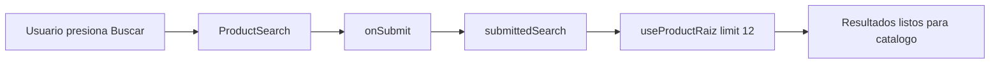

# GUIA DE BARRA DE BUSQUEDA DE PRODUCTOS

## IDEA GENERAL

La busqueda de productos se crea una sola vez en `ProductPageContainer` mediante `useProductSearch`. Ese modelo se comparte con el header de escritorio y el header movil.

## ARCHIVOS QUE PARTICIPAN

| Archivo | Responsabilidad |
| --- | --- |
| `components/compartidos/layout/ProductSearch.tsx` | Componente visual de la barra. |
| `features/products/types/productSearch.types.ts` | Tipos `ProductSearchModel` y `ProductSearchProps`. |
| `features/products/hooks/useProductSearch.ts` | Estado y acciones de busqueda. |
| `features/products/hooks/useProductRaiz.ts` | Hook base interno para consultar productos. |
| `features/products/api/productsApi.ts` | Arma llamadas a la API de productos. |
| `lib/axiosClient.ts` | Ejecuta la peticion HTTP. |

## MODELO DE DATOS

## FLUJO AL ESCRIBIR

## FLUJO AL ENVIAR

## REGLAS DE MANTENIMIENTO

- El componente visual no debe guardar la logica de consulta.
- Los tipos compartidos deben quedarse en `features/products/types/`.
- El limite visible del desplegable puede quedarse cerca del componente si solo afecta a esa UI.
- Las llamadas HTTP deben pasar por `productsApi.ts` y `axiosClient.ts`.
