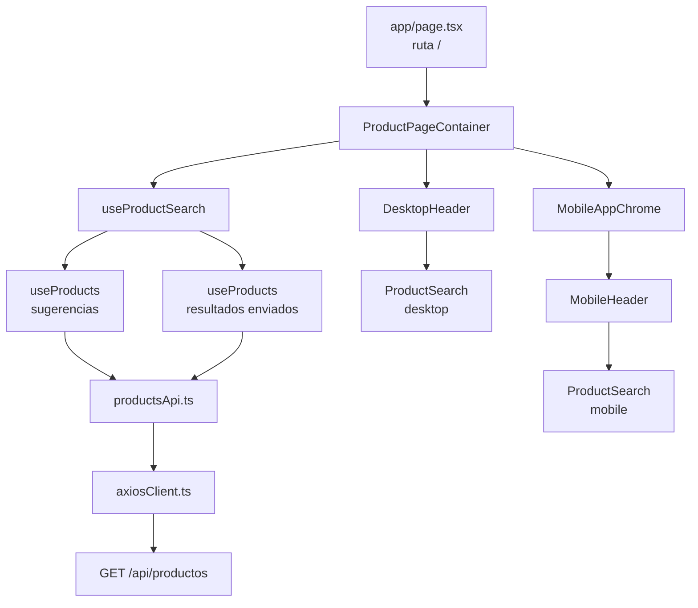
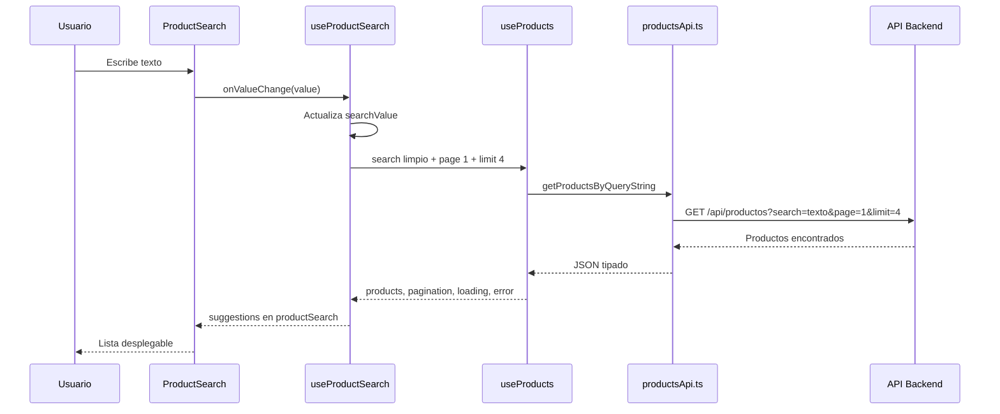
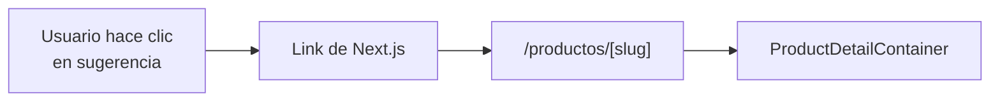
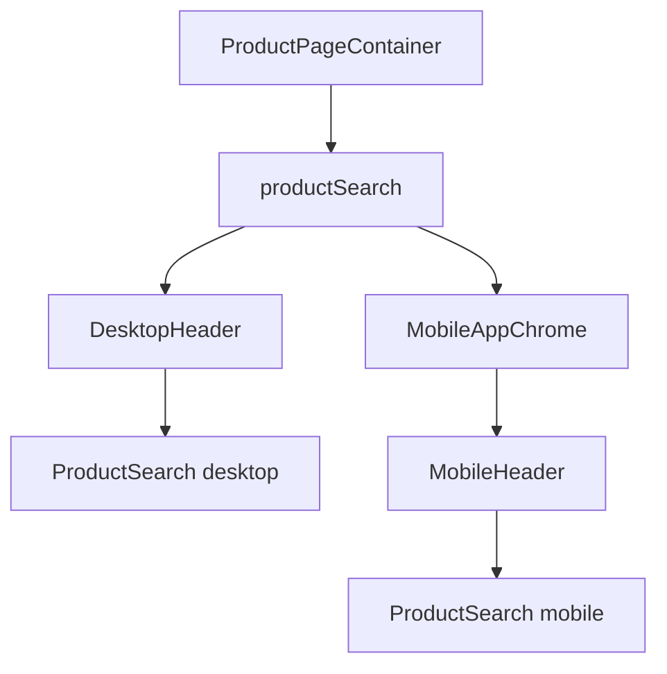
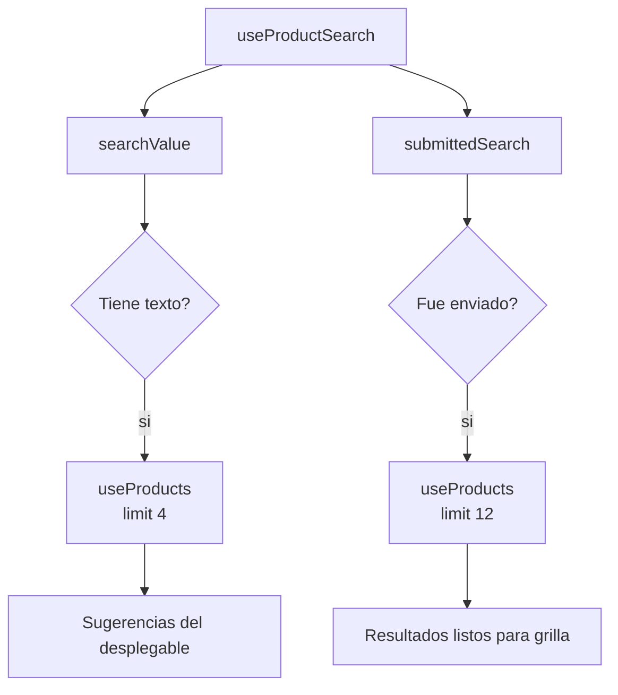
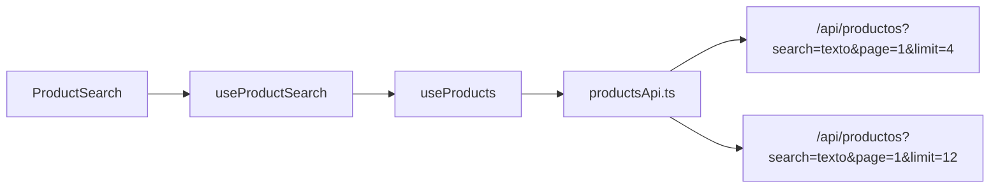

# Guia simple: barra de busqueda de productos

## Idea general

En esta app, la busqueda de productos se crea una sola vez en `ProductPageContainer` y se comparte con el header de escritorio y el header movil.

## Que hace cada parte

### `app/page.tsx`

Es la pagina principal `/`.

Solo renderiza:

- `ProductPageContainer`

### `ProductPageContainer`

Es el componente que arma la pantalla principal.

Hace esto:

- llama a `useProductSearch`;
- recibe `productSearch`, `results` y `submittedSearch`;
- pasa `productSearch` a `DesktopHeader`;
- pasa `productSearch` a `MobileAppChrome`;
- por ahora registra en consola los resultados enviados.

### `useProductSearch`

Guarda el estado principal de la barra.

Maneja dos textos:

- `searchValue`: texto que el usuario esta escribiendo;
- `submittedSearch`: texto enviado con `Buscar` o `Mostrar mas coincidencias`.

Tambien arma el modelo que consume `ProductSearch`.

### `useProducts`

Consulta la API de productos.

Se usa dos veces:

- para sugerencias con `limit: 4`;
- para resultados enviados con `limit: 12`.

### `ProductSearch`

Es el componente visual de la barra.

Muestra:

- input controlado;
- boton buscar;
- estado de carga;
- error;
- mensaje sin resultados;
- sugerencias;
- boton `Mostrar mas coincidencias`.

## Flujo al escribir

Cuando el usuario escribe, el input cambia `searchValue`. Ese texto limpio se usa para pedir sugerencias.

## Flujo al hacer clic

Cada sugerencia abre el detalle del producto usando su `slug`.

## Modo movil y escritorio

La logica vive en un solo lugar, pero la UI aparece en dos headers.

En escritorio:

- `DesktopHeader` recibe `productSearch`;
- renderiza `ProductSearch` con variante por defecto.

En movil:

- `MobileAppChrome` recibe `productSearch`;
- lo pasa a `MobileHeader`;
- `MobileHeader` renderiza `ProductSearch` con `variant="mobile"`.

## Sugerencias y busqueda enviada

Hay dos consultas separadas para no mezclar el desplegable con la busqueda final.

## Rutas de API

La barra usa la misma ruta publica de productos. Lo que cambia son los query params.

Ejemplos:

- sugerencias: `GET /api/productos?search=faro&page=1&limit=4`;
- busqueda enviada: `GET /api/productos?search=faro&page=1&limit=12`;
- detalle: `/productos/slug-del-producto`.

## Estado actual

Ahora mismo:

- las sugerencias al escribir si usan datos de la API;
- el clic en una sugerencia si abre el detalle por `slug`;
- el boton `Buscar` si consulta resultados con `limit: 12`;
- la grilla visible todavia usa `catalogProducts`.

Para que la grilla muestre la busqueda enviada, hay que conectar `results.products` con `ProductGrid`.

## Resumen corto

- `ProductPageContainer` = crea la logica de busqueda.
- `useProductSearch` = guarda texto, sugerencias y resultados enviados.
- `useProducts` = consulta la API.
- `ProductSearch` = dibuja input y sugerencias.
- `DesktopHeader` = barra en escritorio.
- `MobileHeader` = barra en movil.
- `productsApi.ts` = arma `/api/productos?search=...`.
