# GUIA DE FEATURES, LIB Y PROVIDERS

## OBJETIVO

Esta guia explica los archivos `.ts` que viven en `features`, los archivos de `lib` y el provider `providers/ThemeProvider.tsx`. La idea es entender que hacen, que datos estructuran y entre que componentes funcionan como intermediarios.

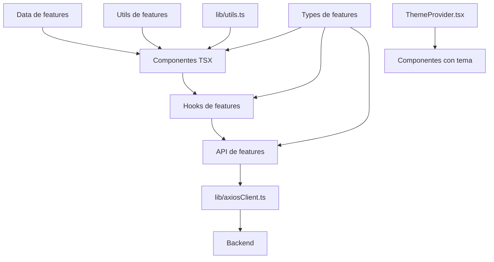

## MAPA GENERAL

| Zona | Archivos | Funcion |
| --- | --- | --- |
| `features/products/types/` | `product.types.ts`, `productSearch.types.ts`, `productFilterOptions.types.ts` | Define la forma de productos, filtros, respuestas, busqueda y estado de opciones. |
| `features/products/hooks/` | `useProductRaiz.ts`, `useProductSearch.ts`, `useProductFilters.ts`, `useProductFilterOptions.ts` | Conecta componentes con datos y estados reutilizables. |
| `features/products/api/` | `productsApi.ts` | Traduce parametros del frontend a rutas del backend. |
| `features/products/data/` | `catalogData.ts` | Datos locales temporales o estaticos para la UI. |
| `features/products/utils/` | `productImage.ts` | Helper para adaptar imagenes de producto. |
| `features/cart/types/` | `cart.types.ts` | Contrato base de un item de carrito. |
| `features/cart/store/` | `cartStore.ts` | Placeholder del store futuro del carrito. |
| `lib/` | `axiosClient.ts`, `utils.ts` | Herramientas compartidas por toda la app. |
| `providers/` | `ThemeProvider.tsx` | Provider global para modo claro/oscuro. |

## GRAFICO DE CAPAS

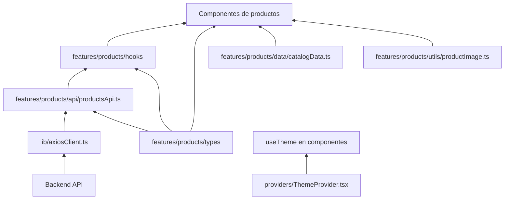

## FEATURES PRODUCTS TYPES

### `features/products/types/product.types.ts`

Define los contratos principales de productos.

| Tipo | Para que sirve | Quien lo usa |
| --- | --- | --- |
| `Product` | Producto local usado por cards mock actuales. | `ProductGrid`, `MobileProductGrid`, `DesktopProductGrid`, `ProductCardBase`, `MobileProductCard`, `catalogData.ts`. |
| `CategoryItem` | Categoria local para tiras y grillas. | `catalogData.ts`, `CategoryStrip` por medio de props. |
| `ProductApiItem` | Producto real que llega desde la API. | `useProductRaiz.ts`, `productSearch.types.ts`. |
| `ProductListParams` | Filtros que el frontend puede enviar como query params. | `productsApi.ts`, `useProductRaiz.ts`. |
| `ProductPagination` | Estado de paginacion del backend. | `useProductRaiz.ts`, `productSearch.types.ts`. |
| `ProductListResponse` | Respuesta de `GET /api/productos`. | `productsApi.ts`. |
| `ProductFilterOptions` | Opciones para construir filtros. | `useProductFilterOptions.ts`. |
| `ProductFilterOptionsResponse` | Respuesta de `GET /api/productos/filtros-opciones`. | `productsApi.ts`. |

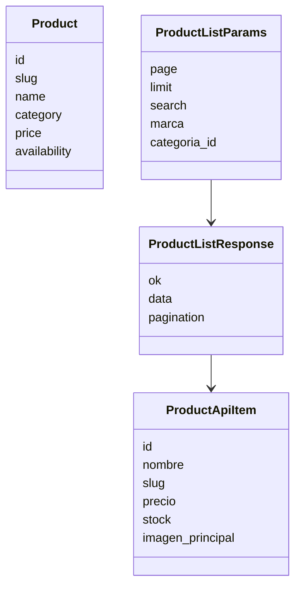

### `features/products/types/productSearch.types.ts`

Define el contrato que conecta el hook de busqueda con los headers y el componente visual.

| Tipo | Funcion | Donde va |
| --- | --- | --- |
| `ProductSearchModel` | Estado y acciones de la barra de busqueda. | Sale de `useProductSearch` y entra en `DesktopHeader`, `MobileAppChrome`, `MobileHeader` y `ProductSearch`. |
| `ProductSearchProps` | Props publicas del componente visual `ProductSearch`. | Entra en `components/compartidos/layout/ProductSearch.tsx`. |

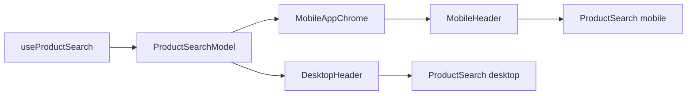

### `features/products/types/productFilterOptions.types.ts`

Define el modelo que viaja desde `useProductFilterOptions` hacia los componentes de filtros.

| Tipo | Funcion | Donde va |
| --- | --- | --- |
| `ProductFilterOptionsModel` | Estado de opciones, carga y error del formulario de filtros. | Sale de `useProductFilterOptions` y entra en `ProductPageContainer`, `MobileAppChrome`, `MobileFilterDrawer` y `ProductFilters`. |

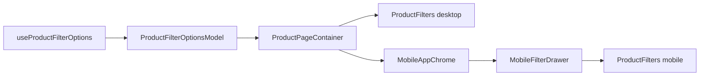

## FEATURES PRODUCTS API

### `features/products/api/productsApi.ts`

Este archivo es el intermediario entre hooks y backend. Los componentes no deberian construir URLs manualmente.

| Funcion | Que hace | Consumidor |
| --- | --- | --- |
| `createProductsQueryString` | Convierte filtros en query string. | `useProductRaiz.ts`, `getProducts`. |
| `getProducts` | Recibe params y pide productos. | Disponible para hooks o futuras pantallas. |
| `getProductsByQueryString` | Pide productos con query string ya armado. | `useProductRaiz.ts`. |
| `getProductFilterOptions` | Pide categorias, marcas, modelos, anios, precios y disponibilidad. | `useProductFilterOptions.ts`. |

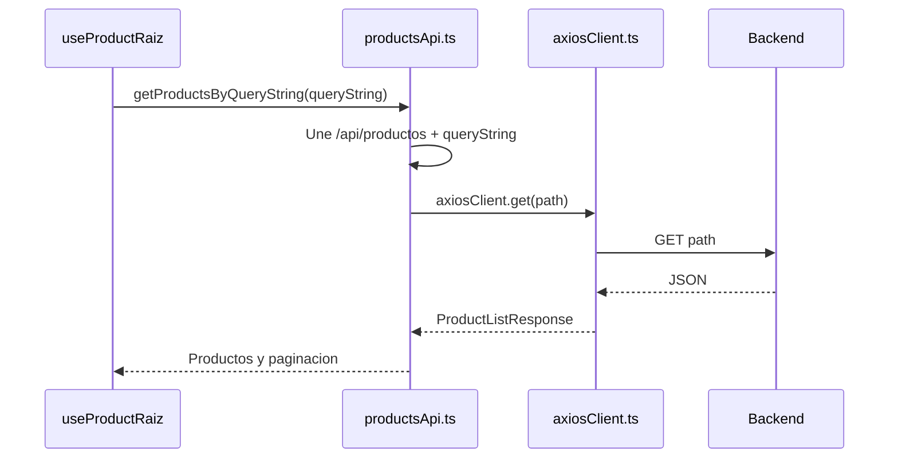

## FEATURES PRODUCTS HOOKS

### `features/products/hooks/useProductRaiz.ts`

Hook generico para listar, buscar y filtrar productos.

| Entrada | Salida | Componentes relacionados |
| --- | --- | --- |
| `ProductListParams` | `products`, `pagination`, `isLoading`, `error` | Hoy lo usa `useProductSearch`; tambien queda listo para futuros filtros o catalogo real. |

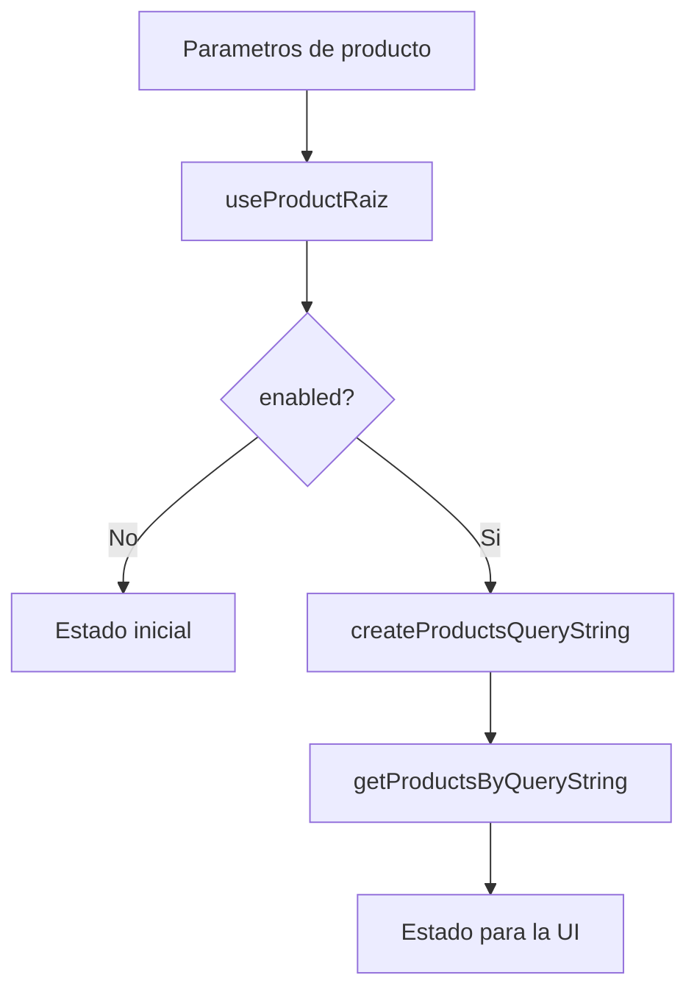

### `features/products/hooks/useProductSearch.ts`

Hook especializado para la barra de busqueda.

| Dato interno | Funcion |
| --- | --- |
| `searchValue` | Texto que el usuario escribe. |
| `submittedSearch` | Texto que el usuario envio con buscar o mostrar mas. |
| `suggestions` | Consulta corta con `limit: 4`. |
| `results` | Consulta principal con `limit: 12`. |
| `productSearch` | Modelo que consumen los headers y `ProductSearch`. |

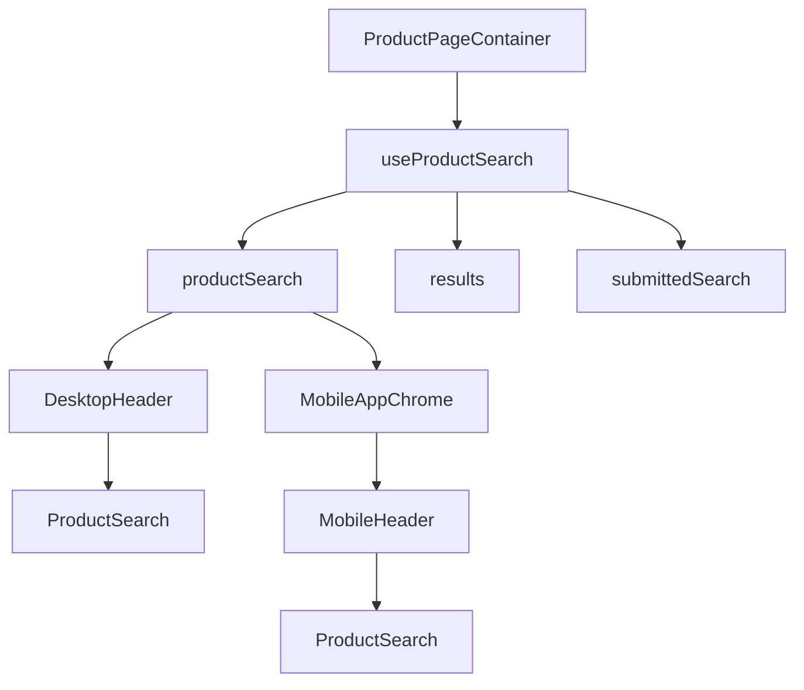

### `features/products/hooks/useProductFilterOptions.ts`

Hook para cargar opciones reales de filtros desde el backend.

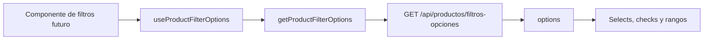

## FEATURES PRODUCTS DATA

### `features/products/data/catalogData.ts`

Contiene datos locales que alimentan la UI mientras el catalogo se conecta por partes a la API real.

| Export | Tipo | Donde se usa |
| --- | --- | --- |
| `catalogProducts` | `Product[]` | `ProductPageContainer`, `ProductDetailContainer`. |
| `catalogCategories` | `CategoryItem[]` | `ProductPageContainer` hacia `CategoryStrip`. |

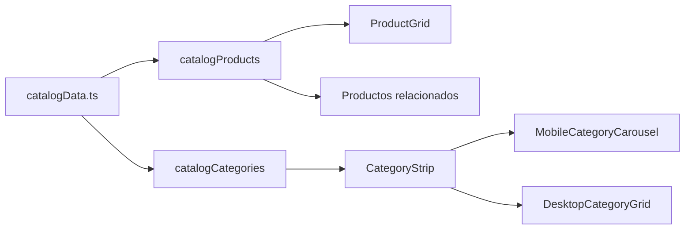

## FEATURES PRODUCTS UTILS

### `features/products/utils/productImage.ts`

Contiene `getSmallProductImage`, helper usado para optimizar imagenes pequenas en sugerencias.

| Funcion | Entrada | Salida | Consumidor |
| --- | --- | --- | --- |
| `getSmallProductImage` | URL de imagen | URL ajustada si es Unsplash o la original si no aplica | `ProductSearch.tsx` |

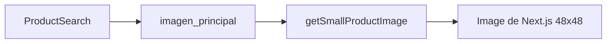

## FEATURES CART

### `features/cart/types/cart.types.ts`

Define `CartItem`, el contrato base para un item de carrito.

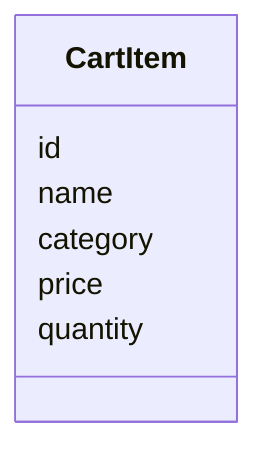

Actualmente el carrito visual tiene props locales en `components/compartidos/carrito/CartItem.tsx`. Este tipo queda como contrato de feature para cuando el carrito se conecte a un store real.

### `features/cart/store/cartStore.ts`

Contiene `cartStorePlaceholder`. Es un placeholder sin logica real todavia, preparado para una futura implementacion con Zustand, Context o Redux.

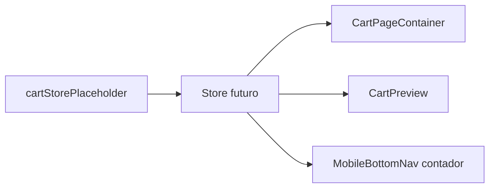

## LIB

### `lib/axiosClient.ts`

Cliente HTTP compartido. Centraliza la URL base, query params, cancelacion con `AbortSignal` y errores de API.

| Pieza | Funcion |
| --- | --- |
| `QueryValue` | Tipo interno para valores permitidos en query params. |
| `GetOptions` | Opciones de `get`: `params` y `signal`. |
| `trimTrailingSlash` | Evita dobles barras en la URL base. |
| `appendQueryParams` | Agrega filtros a la URL. |
| `get<T>` | Ejecuta `fetch` y devuelve JSON tipado. |
| `axiosClient` | Objeto compartido con `baseURL` y `get`. |

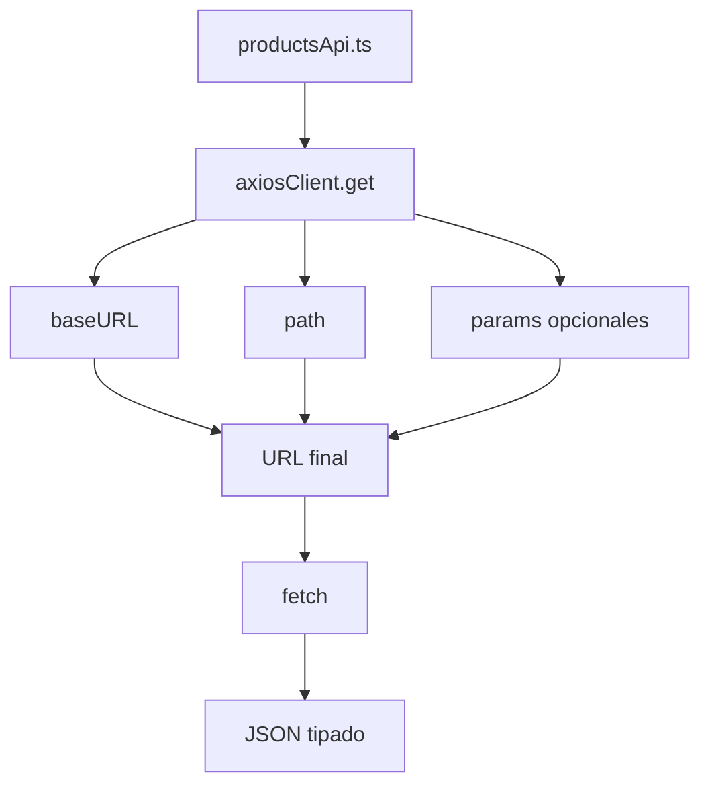

### `lib/utils.ts`

Contiene `cn`, helper simple para unir clases condicionales.

| Funcion | Donde se usa |
| --- | --- |
| `cn` | `Input`, `Button`, `Badge`, `ProductSearch`, `ProductFilters`. |

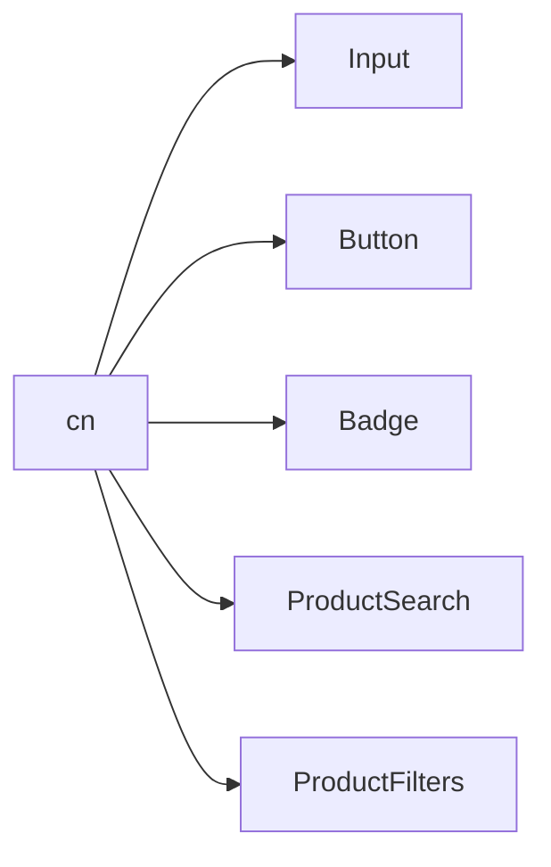

## PROVIDERS

### `providers/ThemeProvider.tsx`

Provider cliente que envuelve `next-themes` y permite alternar tema claro/oscuro.

| Configuracion | Valor | Efecto |
| --- | --- | --- |
| `attribute` | `class` | El tema se aplica como clase en `<html>`. |
| `defaultTheme` | `light` | La app inicia esperando tema claro. |
| `enableSystem` | `false` | No depende del tema del sistema operativo. |
| `disableTransitionOnChange` | activo | Evita transiciones raras al cambiar tema. |

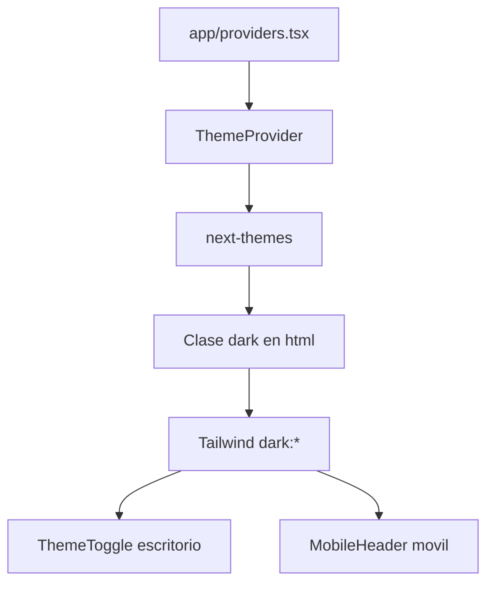

## MAPA DE CONSUMO POR COMPONENTE

| Componente | Recibe desde features/lib/providers |
| --- | --- |
| `ProductPageContainer` | `catalogProducts`, `catalogCategories`, `useProductSearch`, `useProductFilterOptions`. |
| `ProductSearch` | `ProductSearchProps`, `getSmallProductImage`, `cn`. |
| `DesktopHeader` | `ProductSearchModel`. |
| `MobileAppChrome` | `ProductSearchModel`, `ProductFilterOptionsModel` cuando viene desde el catalogo. |
| `MobileHeader` | `ProductSearchModel`, tema por `ThemeProvider`. |
| `ProductFilters` | `ProductFilterOptionsModel`, `cn`. |
| `ProductGrid` | `Product`. |
| `MobileProductGrid` | `Product`. |
| `DesktopProductGrid` | `Product`. |
| `ProductCardBase` | `Product`. |
| `ProductDetailContainer` | `catalogProducts`. |
| `Input`, `Button`, `Badge` | `cn`. |
| `ThemeToggle` | Tema provisto por `ThemeProvider`. |

## RESUMEN DE INTERMEDIARIOS

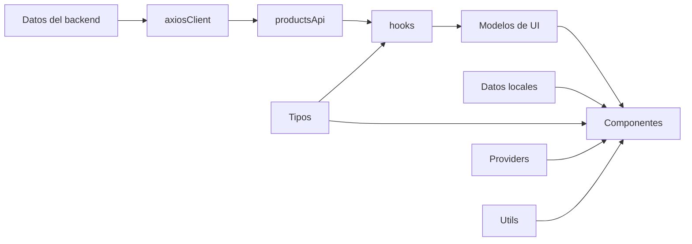

Regla practica:

- Si estructura datos compartidos, va en `features/*/types`.
- Si consulta backend, va en `features/*/api`.
- Si guarda logica reutilizable de React, va en `features/*/hooks`.
- Si transforma datos sin JSX, va en `features/*/utils` o `lib`.
- Si envuelve la app con contexto global, va en `providers`.
