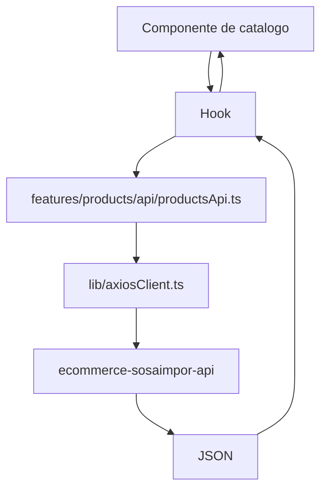
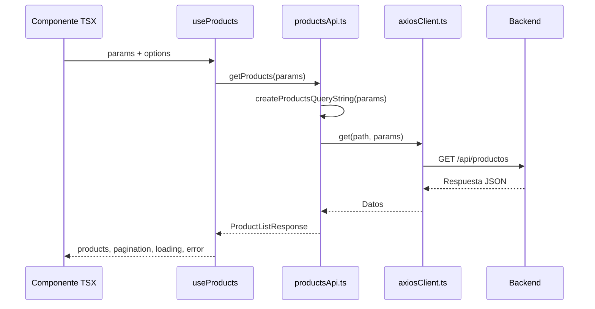
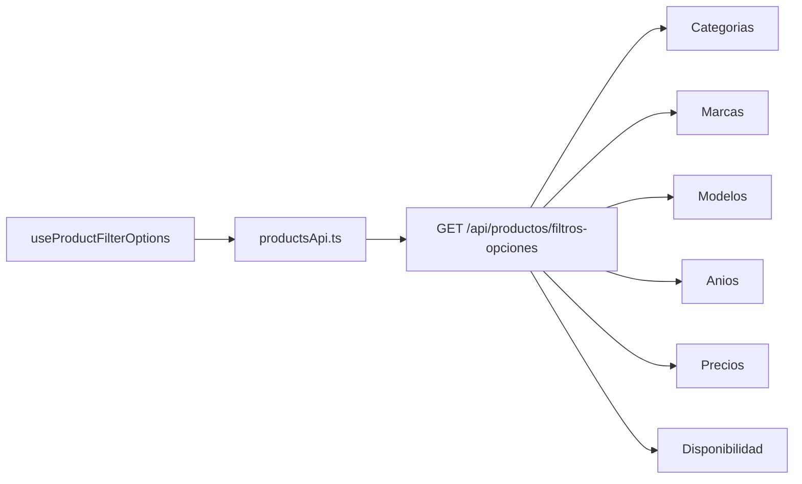
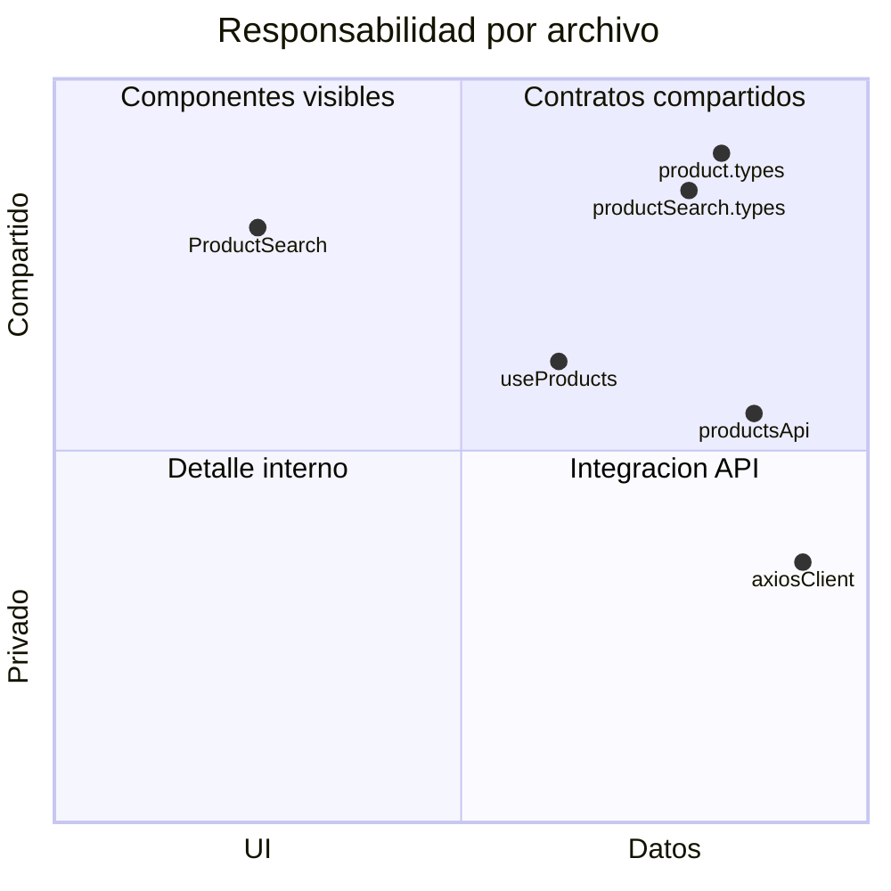

# GUIA FRONTEND DE BUSQUEDA Y FILTROS DE PRODUCTOS

## OBJETIVO

Esta guia explica como el frontend lista, busca, pagina y filtra productos usando la API publica del backend.



## ARCHIVOS PRINCIPALES

| Archivo | Responsabilidad |
| --- | --- |
| `features/products/types/product.types.ts` | Tipos de productos, filtros, paginacion y opciones. |
| `features/products/types/productSearch.types.ts` | Modelo de busqueda usado por headers y barra. |
| `features/products/api/productsApi.ts` | Construye query strings y llama rutas de productos. |
| `features/products/hooks/useProducts.ts` | Hook para listar, buscar o filtrar productos. |
| `features/products/hooks/useProductSearch.ts` | Hook especializado para barra de busqueda y sugerencias. |
| `features/products/hooks/useProductFilterOptions.ts` | Hook para traer opciones reales de filtros. |
| `lib/axiosClient.ts` | Cliente HTTP comun. |

## RUTAS DEL BACKEND

| Caso | Ruta |
| --- | --- |
| Listado | `GET /api/productos?page=1&limit=12` |
| Busqueda | `GET /api/productos?search=faro&page=1&limit=12` |
| Filtro | `GET /api/productos?marca=Toyota&page=1&limit=12` |
| Filtros combinados | `GET /api/productos?categoria_id=1&marca=Toyota&search=faro&page=1&limit=12` |
| Opciones de filtros | `GET /api/productos/filtros-opciones` |

## FLUJO DE LISTADO



## FLUJO DE OPCIONES DE FILTRO



## GRAFICO DE RESPONSABILIDADES



## COMO COMBINAR FILTROS

Los filtros no necesitan rutas nuevas. Se combinan como query params:

```txt
categoria_id=1
marca=Toyota
modelo=Corolla
search=faro
page=1
limit=12
```

`productsApi.ts` elimina parametros vacios y conserva solo los valores utiles antes de llamar a `axiosClient.ts`.

## REGLAS DE MANTENIMIENTO

- Las pantallas consumen hooks, no llaman `fetch` directamente.
- Las rutas del backend se centralizan en `productsApi.ts`.
- Los tipos compartidos se guardan en `features/products/types/`.
- Las opciones de filtros solo alimentan controles; no filtran por si solas.
- La combinacion final de filtros debe terminar en `useProducts`.

