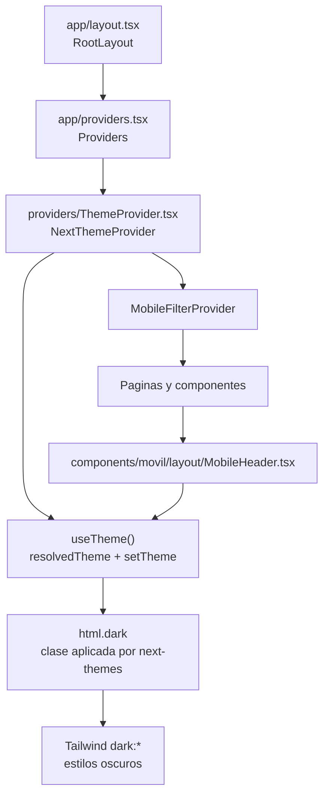
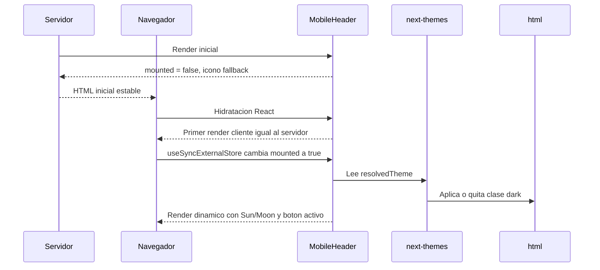
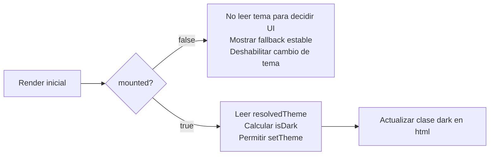

# Guia visual: hidratacion del tema en MobileHeader

Esta guia resume como interactuan `MobileHeader` y `ThemeProvider`, y cual es el patron usado para evitar errores de hidratacion cuando el tema se resuelve en el navegador.

## Componentes involucrados



## Flujo de render

El servidor no conoce el tema guardado en el navegador. Por eso el primer render debe ser estable y no depender de `resolvedTheme`.



## Patron anti-hidratacion



Codigo clave en `MobileHeader`:

```tsx
const mounted = useSyncExternalStore(
  subscribe,
  getClientSnapshot,
  getServerSnapshot,
);

const { resolvedTheme, setTheme } = useTheme();
const isDark = mounted && resolvedTheme === "dark";

function handleThemeToggle() {
  if (!mounted) {
    return;
  }

  setTheme(isDark ? "light" : "dark");
}
```

## Reglas para nuevos componentes de tema

- No uses `resolvedTheme`, `theme`, `localStorage` o `matchMedia` para decidir el HTML del primer render.
- Usa un estado de montaje estable antes de mostrar UI dependiente del tema.
- Mientras `mounted` sea `false`, renderiza un fallback fijo.
- Ejecuta `setTheme` solo despues de que `mounted` sea `true`.
- Mantener `suppressHydrationWarning` en `<html>` ayuda porque `next-themes` puede cambiar la clase `dark` durante la hidratacion.

## Resumen

`ThemeProvider` controla la clase `dark` en `<html>`. `MobileHeader` consume `useTheme()`, pero solo aplica logica dinamica cuando el componente ya esta montado en cliente. Ese retraso intencional evita que el HTML generado por el servidor sea distinto al primer render del navegador.
