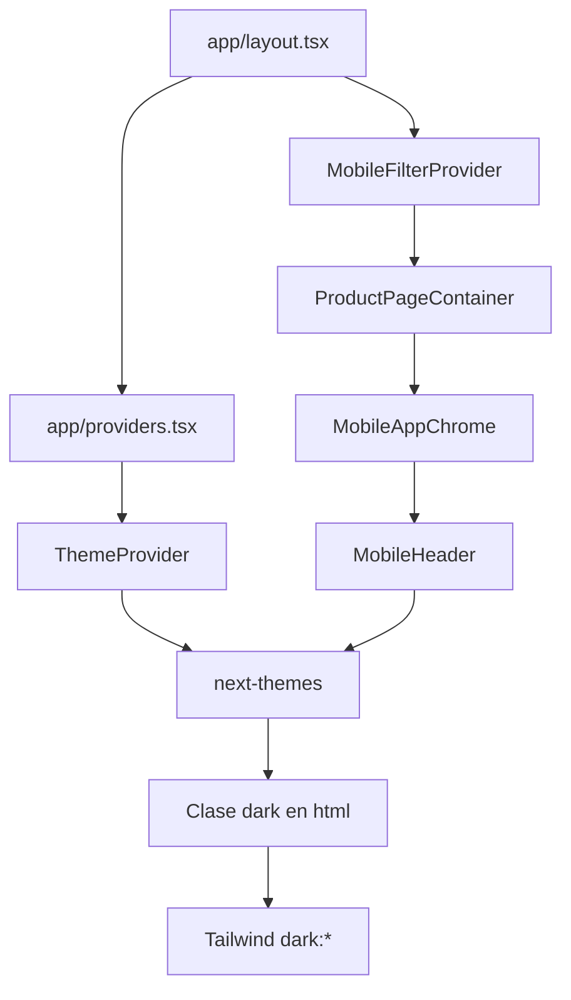
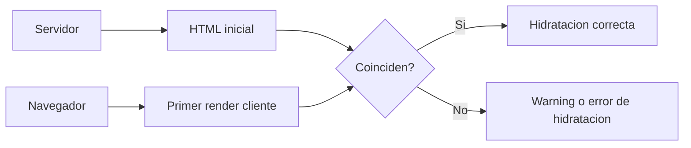
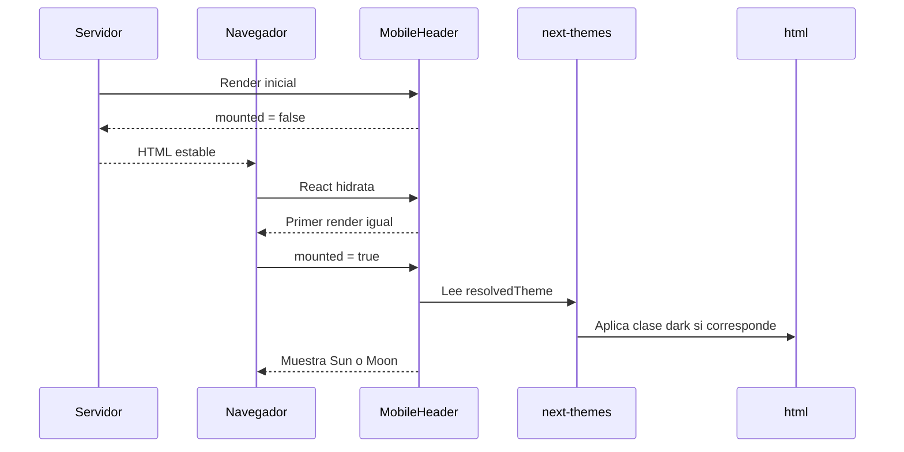
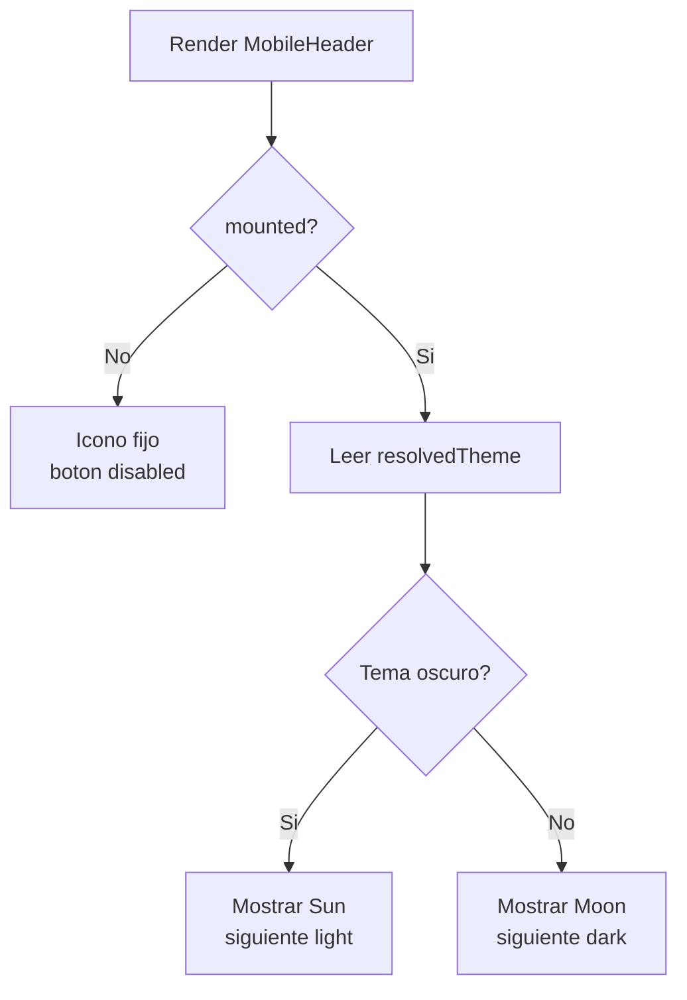

# GUIA DE HIDRATACION DEL TEMA EN MOBILEHEADER

## IDEA GENERAL

El tema claro/oscuro lo controla `next-themes`. En Next.js, el servidor renderiza antes de conocer el tema real del navegador; por eso `MobileHeader` espera a estar montado antes de cambiar el icono de tema.

## PROBLEMA QUE SE EVITA

Si el servidor pinta un icono y el cliente pinta otro en el primer render, React detecta diferencia. Por eso el componente usa un estado estable antes de leer `resolvedTheme`.

## ARCHIVOS QUE PARTICIPAN

| Archivo | Funcion |
| --- | --- |
| `providers/ThemeProvider.tsx` | Configura `next-themes`. |
| `app/providers.tsx` | Monta el provider de tema. |
| `app/layout.tsx` | Usa `suppressHydrationWarning` en `<html>`. |
| `components/movil/layout/MobileHeader.tsx` | Lee tema y cambia el boton movil. |
| `components/compartidos/layout/ThemeToggle.tsx` | Aplica el mismo patron en escritorio. |

## FLUJO DE HIDRATACION

## PATRON USADO

## REGLAS DE MANTENIMIENTO

- No usar `resolvedTheme` para decidir HTML antes de montar.
- Mantener `suppressHydrationWarning` en el `<html>` global.
- Si se crea otro boton de tema, debe seguir el mismo patron.
- El provider de tema debe envolver cualquier componente que use `useTheme`.

