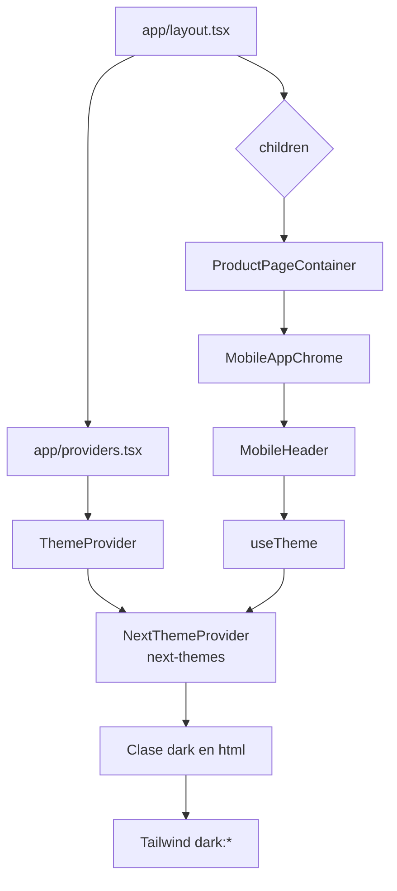
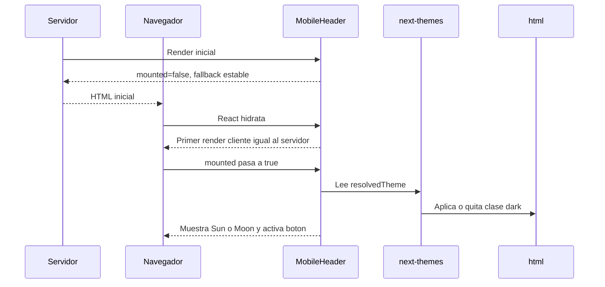
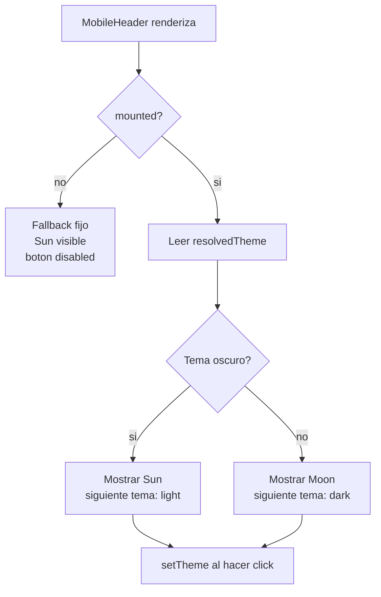
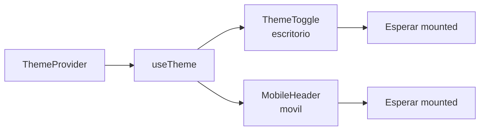
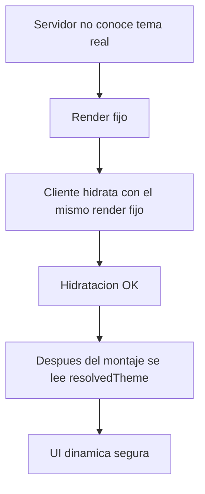

# Guia simple: hidratacion del tema en `MobileHeader`

## Idea general

En esta app, el tema claro/oscuro lo controla `next-themes` desde `ThemeProvider`.

El detalle importante es este:

- el servidor renderiza antes de saber el tema real del navegador;
- el navegador hidrata despues;
- por eso `MobileHeader` no debe usar `resolvedTheme` para cambiar su HTML hasta que el componente ya este montado.



## Que hace cada parte

### `app/layout.tsx`

Es el marco global de toda la app.

Hace esto:

- renderiza `<html lang="es">`;
- usa `suppressHydrationWarning`;
- aplica estilos base al `body`;
- monta `Providers`;
- recibe `children`, que es la pagina activa.

### `app/providers.tsx`

Es el contenedor de providers globales.

Ahora mismo monta:

- `ThemeProvider`

### `ThemeProvider`

Vive en `providers/ThemeProvider.tsx`.

Configura `next-themes` asi:

- `attribute="class"`: el tema se aplica con una clase;
- `defaultTheme="light"`: el primer tema esperado es claro;
- `enableSystem={false}`: no usa automaticamente el tema del sistema;
- `disableTransitionOnChange`: evita transiciones raras al cambiar tema.

### `MobileHeader`

Vive en `components/movil/layout/MobileHeader.tsx`.

Hace esto:

- lee `resolvedTheme` y `setTheme` con `useTheme`;
- calcula `mounted` con `useSyncExternalStore`;
- solo decide entre icono `Sun` y `Moon` cuando `mounted` es `true`;
- deshabilita el boton de tema mientras `mounted` es `false`.

## Flujo de hidratacion



## Patron anti-hidratacion

El patron consiste en separar el primer render del estado dinamico del navegador.



Codigo clave:

```tsx
const mounted = useSyncExternalStore(
  subscribe,
  getClientSnapshot,
  getServerSnapshot,
);

const { resolvedTheme, setTheme } = useTheme();
const isDark = mounted && resolvedTheme === "dark";
const nextTheme = isDark ? "light" : "dark";

function handleThemeToggle() {
  if (!mounted) {
    return;
  }

  setTheme(nextTheme);
}
```

## Escritorio y movil

El mismo patron tambien se usa en el toggle de escritorio.



En escritorio:

- `ThemeToggle` devuelve un boton deshabilitado si no esta montado;
- despues del montaje muestra `Sun` o `Moon`.

En movil:

- `MobileHeader` muestra un icono fijo mientras no esta montado;
- deshabilita el cambio de tema hasta que `mounted` sea `true`.

## Por que evita el error

React compara el HTML del servidor con el primer render del navegador.

Si el servidor pinta una cosa y el cliente pinta otra inmediatamente, aparece un error de hidratacion.



## Regla para seguir programando

Si un componente usa `useTheme`, `localStorage`, `matchMedia` o datos que solo existen en navegador:

- no cambies el HTML inicial con esos datos;
- usa un fallback fijo mientras no este montado;
- ejecuta acciones dinamicas solo despues de `mounted`;
- manten `suppressHydrationWarning` en `<html>` cuando `next-themes` modifica la clase `dark`.

## Resumen corto

- `ThemeProvider` = conecta `next-themes`.
- `next-themes` = agrega o quita `dark` en `<html>`.
- `MobileHeader` = consume `useTheme`.
- `mounted` = barrera antes de usar estado del navegador.
- fallback fijo = evita diferencia entre servidor y primer render cliente.
- `setTheme` = solo se ejecuta despues del montaje.
