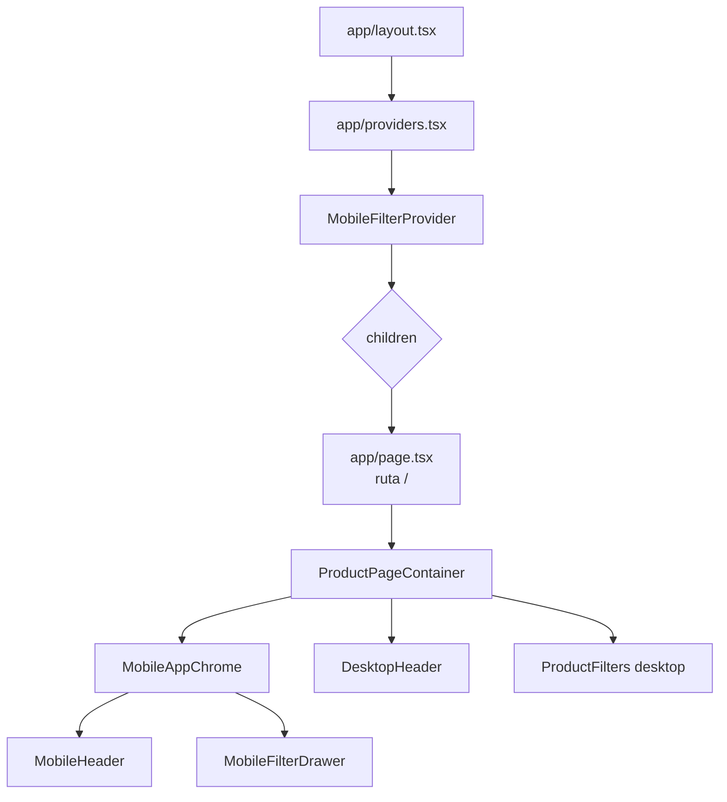
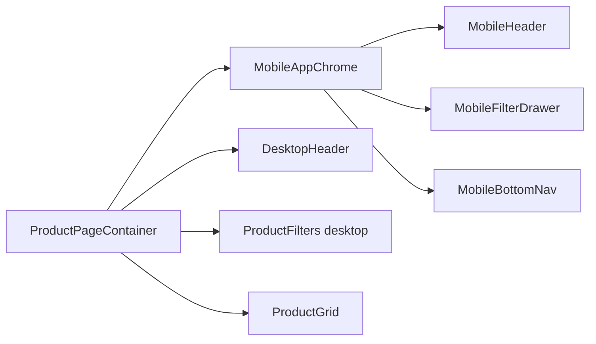
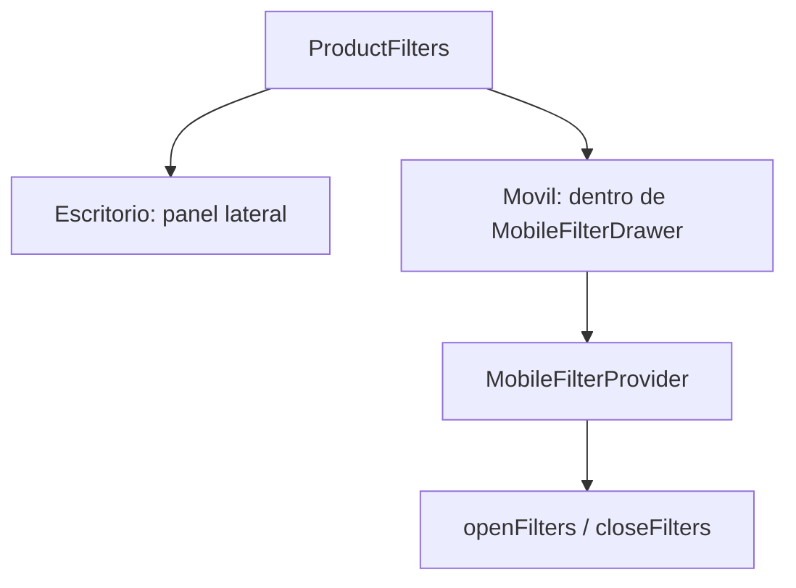

# Guia simple: `layout`, `providers` y `page`

## Idea general

En esta app, el flujo principal es este:

## Que hace cada parte

### `app/layout.tsx`

Es el marco global de toda la app.

Hace esto:

- envuelve todas las paginas;
- aplica estilos base al `html` y `body`;
- monta los providers globales;
- recibe `children`, que es la pagina activa.

### `app/providers.tsx`

Es un contenedor de providers.

Ahora mismo solo pasa:

- `ThemeProvider`

Sirve para compartir el tema claro/oscuro en toda la app.

### `MobileFilterProvider`

Guarda el estado de filtros moviles.

Sirve para:

- abrir filtros;
- cerrar filtros;
- compartir ese estado entre componentes distintos.

### `app/page.tsx`

Es la pagina principal `/`.

Solo renderiza:

- `ProductPageContainer`

### `ProductPageContainer`

Es el componente que arma la pantalla principal.

Dentro decide que se ve en:

- movil;
- escritorio.

## Modo movil y escritorio

## Como funciona el filtro

Si esta en escritorio:

- se ve `ProductFilters` como panel lateral.

Si esta en movil:

- el panel lateral se oculta;
- el boton de filtros abre `MobileFilterDrawer`;
- dentro del drawer se reutiliza `ProductFilters`.

## Resumen corto

- `layout.tsx` = marco global.
- `providers.tsx` = providers globales.
- `children` = pagina activa.
- `page.tsx` = ruta `/`.
- `ProductPageContainer` = pantalla principal.
- `MobileFilterProvider` = estado compartido de filtros moviles.
