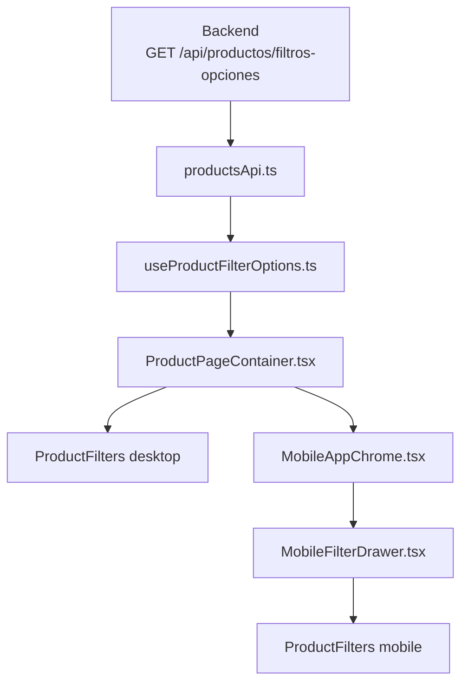
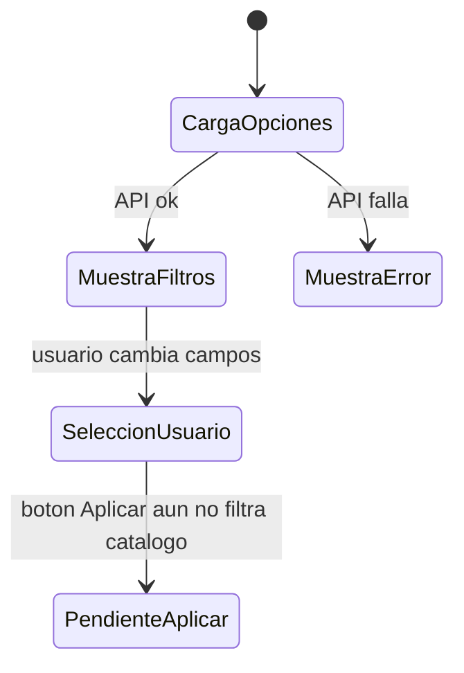
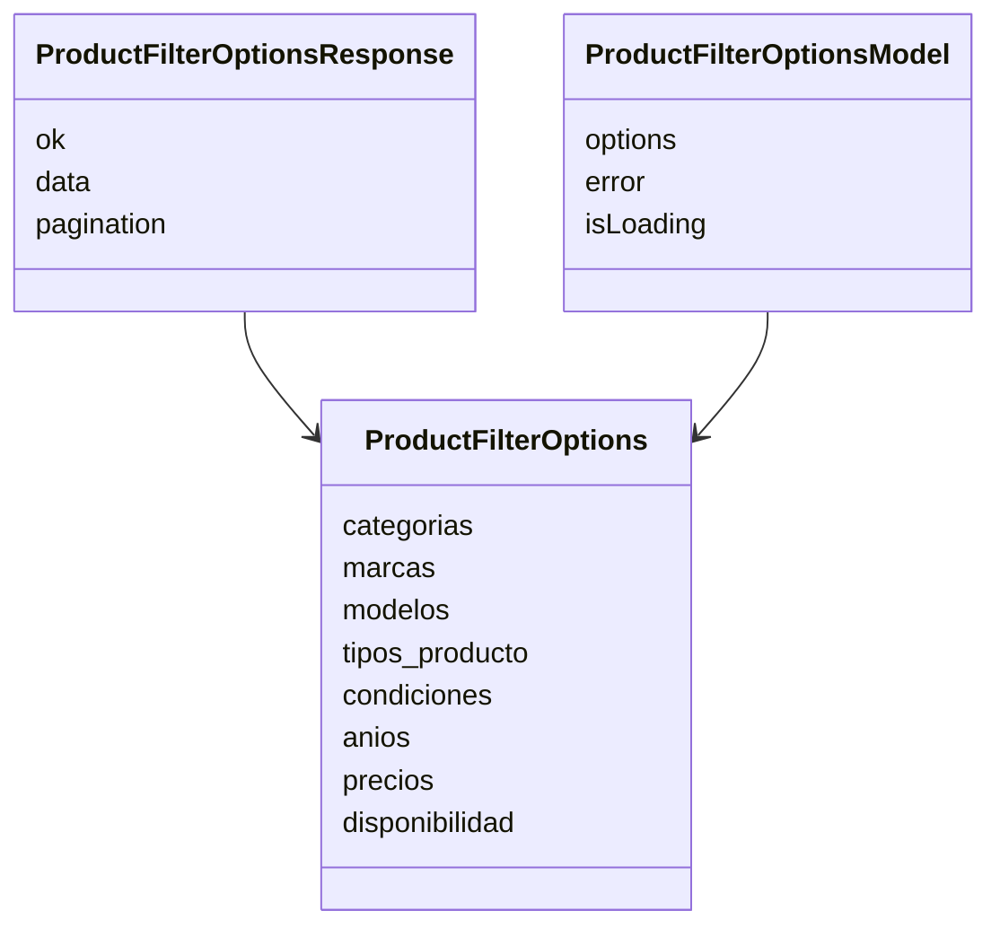
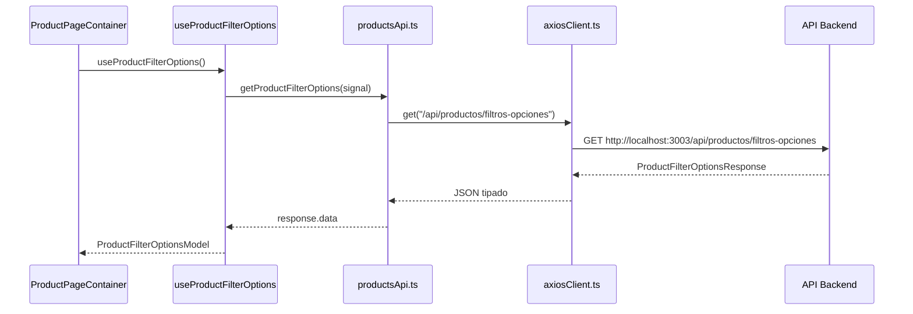
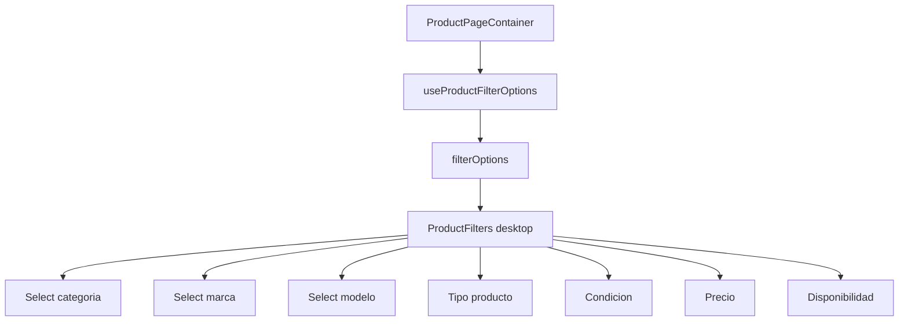
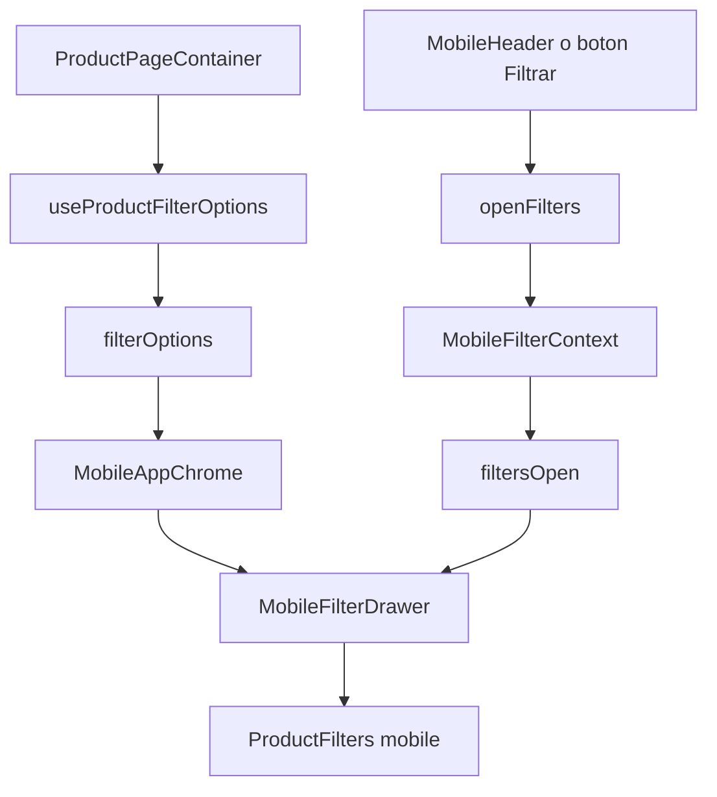
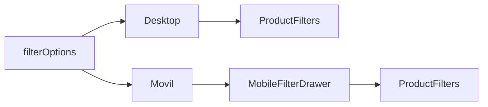
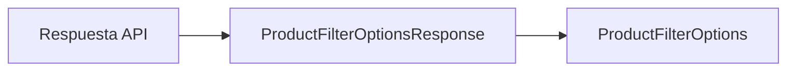
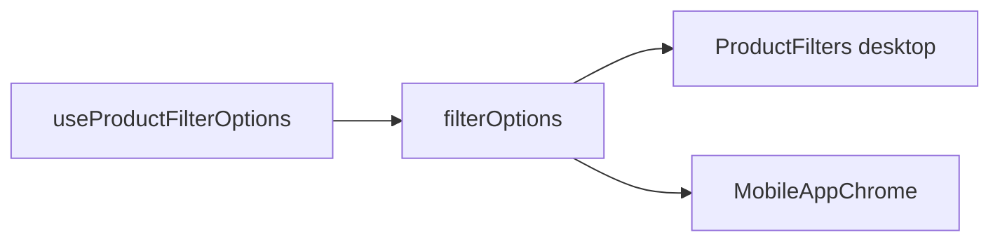
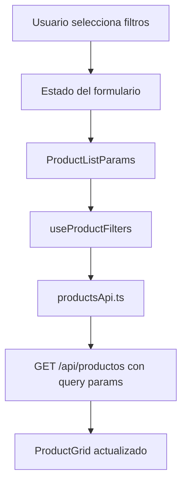

# GUIA_LOGICA_FILTROS.md

## OBJETIVO

Esta guia explica solo la logica de filtros del frontend: de donde vienen los datos, que archivos participan, como llegan al filtro desktop y como llegan al filtro movil.

No se centra en la barra de busqueda ni en el listado general. El foco es este flujo:



## ESTADO ACTUAL

Los datos de opciones de filtros ya se cargan desde la API y se muestran en el componente visual `ProductFilters`.

Estado actual del flujo:

- La API entrega opciones reales: categorias, marcas, modelos, tipos, condiciones, anios, precios y disponibilidad.
- El hook `useProductFilterOptions` carga esas opciones una vez.
- `ProductPageContainer` comparte el mismo estado con filtros desktop y movil.
- `ProductFilters` renderiza los controles usando esas opciones.
- El boton `Aplicar filtros` todavia no envia los valores seleccionados a `useProductFilters`.



## ARCHIVOS QUE PARTICIPAN

| Archivo | Tipo | Responsabilidad |
| --- | --- | --- |
| `features/products/types/product.types.ts` | Types | Define la forma de opciones: `ProductFilterOptions` y `ProductFilterOptionsResponse`. |
| `features/products/types/productFilterOptions.types.ts` | Types | Define `ProductFilterOptionsModel`, el estado que viaja hacia la UI. |
| `features/products/api/productsApi.ts` | API | Llama `GET /api/productos/filtros-opciones`. |
| `features/products/hooks/useProductFilterOptions.ts` | Hook | Carga opciones, maneja loading, error y cancelacion. |
| `components/compartidos/productos/ProductPageContainer.tsx` | Contenedor | Crea el estado de filtros una vez y lo reparte. |
| `components/compartidos/productos/ProductFilters.tsx` | UI compartida | Dibuja selects, radios, precio y boton. |
| `components/movil/layout/MobileAppChrome.tsx` | Intermediario movil | Recibe o carga opciones para el drawer movil. |
| `components/movil/productos/MobileFilterDrawer.tsx` | Contenedor visual movil | Abre el panel y pasa opciones a `ProductFilters`. |
| `components/movil/layout/MobileFilterContext.tsx` | Estado UI movil | Abre y cierra el drawer; no carga datos de filtros. |

## FORMA DE LOS DATOS

La API responde asi:



Campos principales:

| Campo API | Uso en UI |
| --- | --- |
| `categorias` | Select de categoria. |
| `marcas` | Select de marca. |
| `modelos` | Select de modelo. |
| `tipos_producto` | Select de tipo de producto. |
| `condiciones` | Radios de condicion. |
| `anios` | Placeholders de anio minimo y maximo. |
| `precios.precio_min` | Placeholder de precio minimo. |
| `precios.precio_max` | Maximo del rango y placeholder de precio maximo. |
| `disponibilidad` | Radios de disponibilidad. |

## FLUJO API



## FLUJO DESKTOP

En desktop, los filtros viven como panel lateral dentro de `ProductPageContainer`.



Ruta visual desktop:

```txt
ProductPageContainer
+-- div hidden xl:block
    +-- ProductFilters filterOptions={filterOptions}
```

Puntos importantes:

- `ProductPageContainer` es el padre que carga los datos.
- `ProductFilters` no llama directo a la API.
- Desktop usa la misma UI base que movil.
- La diferencia desktop/movil esta en el contenedor y en `variant`.

## FLUJO MOVIL

En movil, los filtros se muestran dentro de un drawer. El estado de abrir/cerrar vive separado del estado de datos.



Ruta visual movil:

```txt
ProductPageContainer
+-- MobileAppChrome filterOptions={filterOptions}
    +-- MobileFilterDrawer
        +-- ProductFilters filterOptions={filterOptions} variant="mobile"
```

Puntos importantes:

- `MobileFilterContext` solo abre y cierra el drawer.
- `MobileFilterContext` no debe pedir datos a la API.
- `MobileFilterDrawer` es solo contenedor visual.
- `ProductFilters` es el mismo componente compartido, pero con `variant="mobile"`.

## COMPARACION DESKTOP Y MOVIL

| Parte | Desktop | Movil |
| --- | --- | --- |
| Donde se carga la API | `ProductPageContainer` | `ProductPageContainer` |
| Donde se muestra | Panel lateral | Drawer inferior |
| Componente visual final | `ProductFilters` | `ProductFilters` |
| Variante | `desktop` por defecto | `variant="mobile"` |
| Estado abrir/cerrar | No aplica | `MobileFilterContext` |
| Fuente de opciones | `filterOptions` | `filterOptions` |



## QUE HACE CADA ARCHIVO

### `product.types.ts`

Define la forma exacta de los datos que vienen del backend.



### `productFilterOptions.types.ts`

Define el modelo que recibe la UI.

```txt
options: ProductFilterOptions | null
error: string | null
isLoading: boolean
```

### `productsApi.ts`

Sabe la ruta exacta:

```txt
/api/productos/filtros-opciones
```

El componente no debe conocer esta ruta directamente.

### `useProductFilterOptions.ts`

Hace tres cosas faciles de depurar:

- inicia en `isLoading: true`;
- guarda `options` si la API responde bien;
- guarda `error` si la API falla.

### `ProductPageContainer.tsx`

Es el punto donde se conectan datos y UI.



### `ProductFilters.tsx`

Solo dibuja controles con los datos recibidos.

No deberia:

- llamar directo a la API;
- saber la URL del backend;
- abrir o cerrar el drawer movil;
- mezclar logica de busqueda.

## PENDIENTE PARA FILTRAR PRODUCTOS

Ahora las opciones ya llegan a la UI. El siguiente paso seria conectar los valores elegidos con `useProductFilters`.

Flujo recomendado:



Estructura recomendada para esa siguiente fase:

| Responsabilidad | Donde deberia vivir |
| --- | --- |
| Valores seleccionados | Hook nuevo o estado en contenedor de catalogo. |
| Convertir seleccion a `ProductListParams` | Helper simple o hook. |
| Ejecutar consulta filtrada | `useProductFilters`, que internamente usa `useProductRaiz`. |
| Pintar productos filtrados | `ProductGrid`. |

## REGLAS PARA MANTENERLO SIMPLE

- Mantener una sola carga de opciones en `ProductPageContainer` para catalogo.
- Pasar datos por props claras: `filterOptions`.
- No hacer `fetch` dentro de `ProductFilters`.
- No mezclar el estado del drawer con el estado de opciones.
- No duplicar filtros desktop y movil: ambos deben usar el mismo `ProductFilters`.
- Cuando se conecte `Aplicar filtros`, hacerlo con `ProductListParams` para seguir usando `useProductFilters`.
