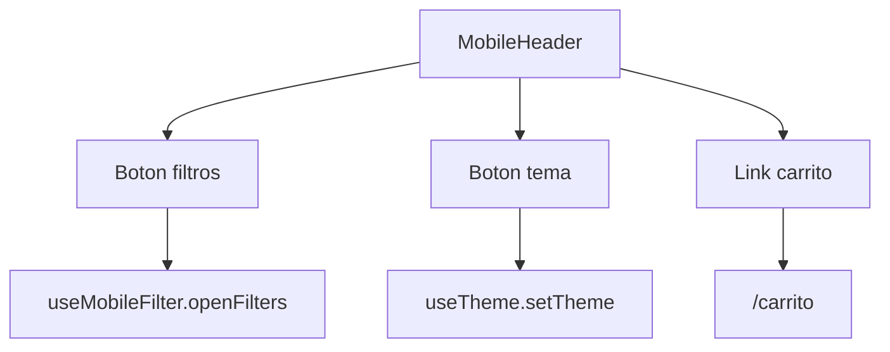
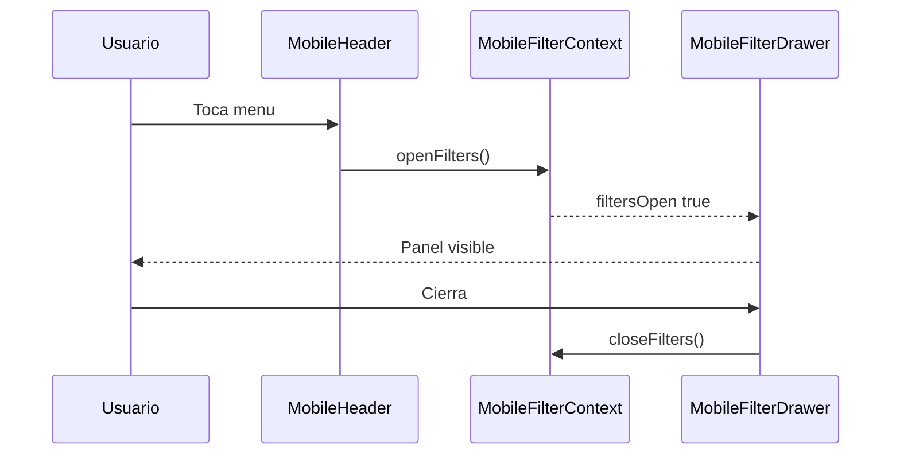
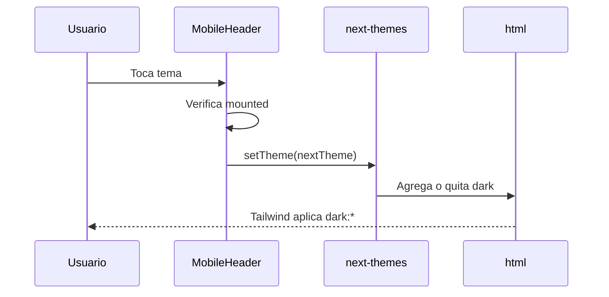
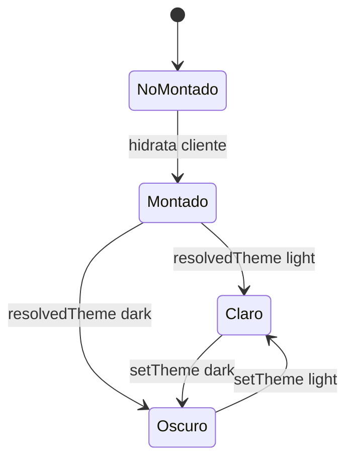

# GUIA DE TEMA Y BOTONES INTERACTIVOS EN MOVIL

## IDEA GENERAL

La UI movil tiene botones que dependen de JavaScript en el navegador: filtros, tema y carrito. El carrito navega con `Link`; filtros y tema ejecutan acciones cliente.

## ARCHIVOS QUE PARTICIPAN

| Archivo | Funcion |
| --- | --- |
| `components/movil/layout/MobileHeader.tsx` | Contiene botones principales del header movil. |
| `components/movil/layout/MobileFilterContext.tsx` | Guarda `filtersOpen`, `openFilters` y `closeFilters`. |
| `components/movil/layout/MobileAppChrome.tsx` | Une header, drawer y bottom nav. |
| `components/movil/productos/MobileFilterDrawer.tsx` | Muestra filtros en panel movil. |
| `providers/ThemeProvider.tsx` | Provee `next-themes`. |
| `components/compartidos/layout/ThemeToggle.tsx` | Toggle equivalente para escritorio. |

## FLUJO DEL BOTON DE FILTROS

## FLUJO DEL BOTON DE TEMA

## GRAFICO DE ESTADOS

## PUNTOS IMPORTANTES

- `MobileHeader` es `"use client"` porque usa hooks de navegador.
- El boton de tema se deshabilita hasta que el componente esta montado.
- El boton de filtros depende de `MobileFilterProvider`.
- `MobileAppChrome` debe estar dentro de `MobileFilterProvider`.
- El carrito usa navegacion normal de Next.js con `Link`.

## REGLAS DE MANTENIMIENTO

- No mezclar estado del drawer dentro del header.
- No duplicar logica de tema entre movil y escritorio si puede vivir en el mismo patron.
- Mantener botones tactiles con tamano estable.
- No cambiar clases Tailwind sin revisar ambos temas.

