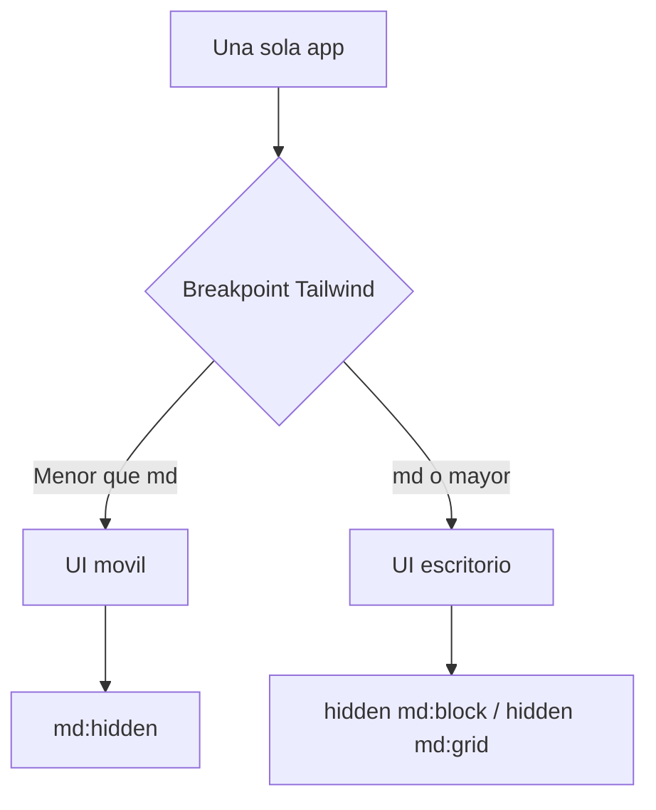
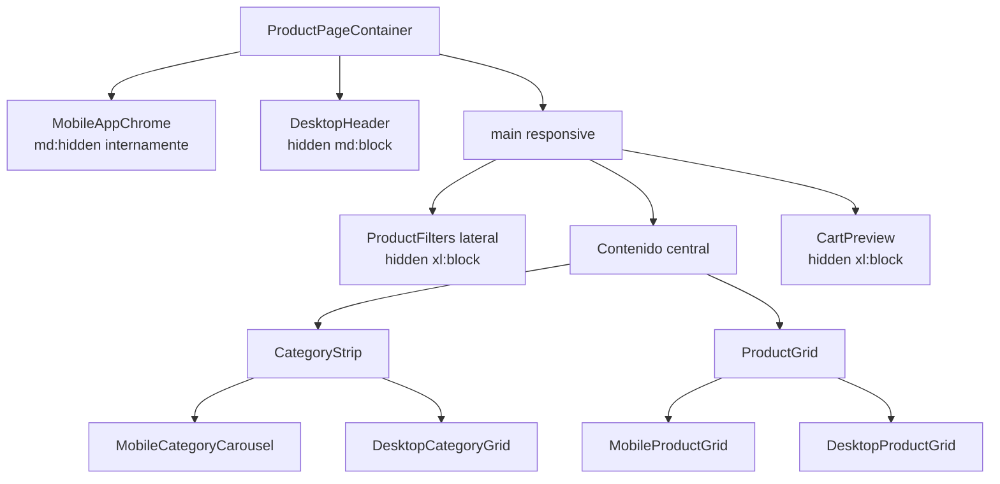
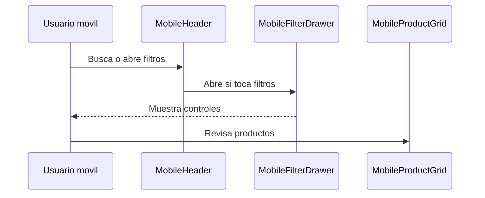
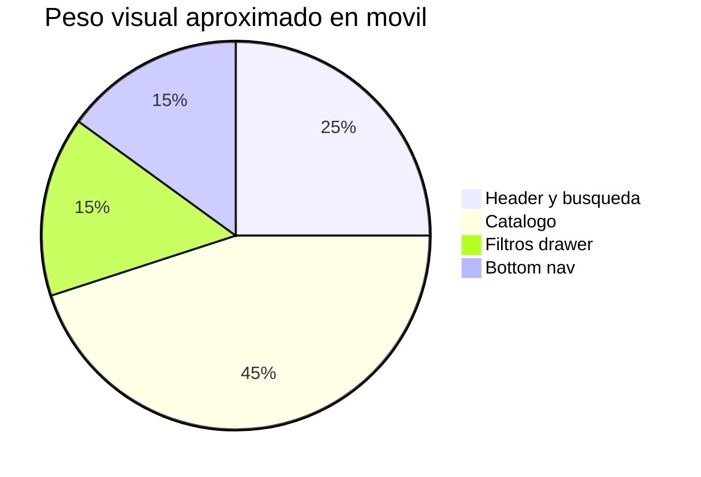

# DOCUMENTACION RESPONSIVE MOVIL

## RESUMEN GENERAL

La version movil esta dentro de la misma app Next.js. La visibilidad depende de clases responsive de Tailwind, no de deteccion manual con JavaScript.

## BREAKPOINTS USADOS

| Clase | Significado en el proyecto |
| --- | --- |
| `md:hidden` | Visible solo en movil. |
| `hidden md:block` | Oculto en movil, visible desde `md`. |
| `hidden md:grid` | Grilla visible desde `md`. |
| `hidden xl:block` | Panel lateral visible solo en escritorio amplio. |
| `pb-20 md:pb-0` | Espacio inferior para bottom nav movil, eliminado en escritorio. |

## ESTRUCTURA RESPONSIVE

## COMPONENTES POR VISTA

| Area | Movil | Escritorio |
| --- | --- | --- |
| Header | `MobileHeader` | `DesktopHeader` |
| Navegacion | `MobileBottomNav` | `Navbar` si se usa en header |
| Filtros | `MobileFilterDrawer` | `ProductFilters` lateral |
| Categorias | `MobileCategoryCarousel` | `DesktopCategoryGrid` |
| Productos | `MobileProductGrid` | `DesktopProductGrid` |
| Footer | Oculto en movil | `DesktopFooter` |

## FLUJO DEL LAYOUT MOVIL

## GRAFICO DE PRIORIDADES MOVILES

## REGLAS DE MANTENIMIENTO

- Mantener el responsive en Tailwind siempre que sea posible.
- Evitar condicionales JavaScript para decidir movil/escritorio.
- Revisar que cada componente movil tenga espacio tactil suficiente.
- Mantener `overflow-x-hidden` para prevenir desbordes horizontales.
- Si se agrega una nueva seccion, definir desde el inicio su variante movil y escritorio.

