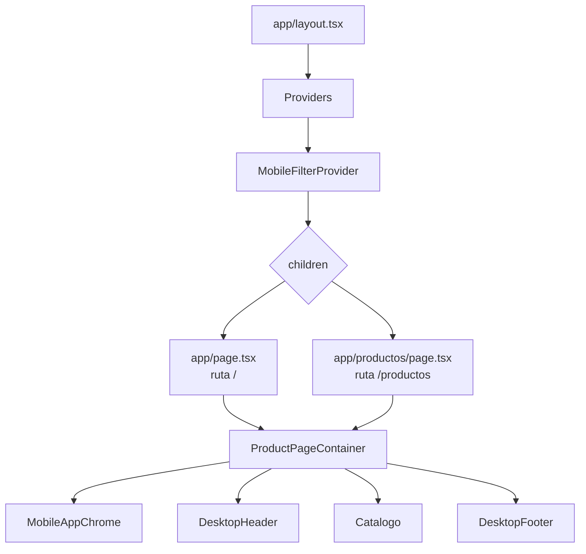
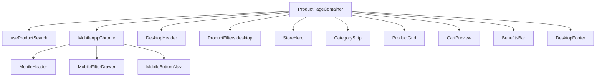
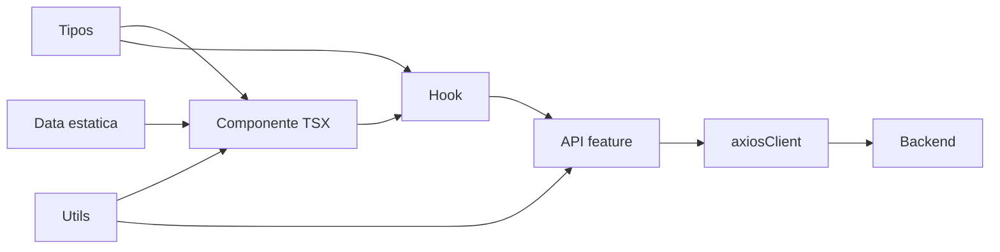

# ESTRUCTURA DE LA APLICACION SOSA IMPORT

## RESUMEN GENERAL

La aplicacion es un frontend ecommerce construido con Next.js App Router, React, TypeScript y Tailwind CSS. La misma ruta renderiza una experiencia responsive: escritorio y movil comparten datos, pero muestran componentes distintos por breakpoint.



## MAPA DE CARPETAS

| Carpeta | Responsabilidad |
| --- | --- |
| `app/` | Rutas, layout global, providers y estilos globales. |
| `components/compartidos/` | Componentes reutilizables entre movil y escritorio. |
| `components/escritorio/` | Componentes especificos para pantallas medianas o grandes. |
| `components/movil/` | Componentes especificos para pantallas pequenas. |
| `features/products/` | API, hooks, tipos, datos y utilidades de productos. |
| `features/cart/` | Tipos y store relacionados con carrito. |
| `lib/` | Utilidades generales y cliente HTTP. |
| `providers/` | Providers globales externos o propios. |

## RUTAS PRINCIPALES

```mermaid
flowchart LR
  A["/"] --> B[app/page.tsx]
  C["/productos"] --> D[app/productos/page.tsx]
  E["/productos/[slug]"] --> F[app/productos/[slug]/page.tsx]
  G["/carrito"] --> H[app/carrito/page.tsx]

  B --> I[ProductPageContainer]
  D --> I
  F --> J[ProductDetailContainer]
  H --> K[CartPageContainer]
```

## FLUJO DE LA PAGINA DE PRODUCTOS

`ProductPageContainer` coordina la pantalla principal. Ahi se crea la busqueda, se monta el chrome movil, se muestra el header de escritorio y se arma el catalogo.



## RESPONSIVE

| Vista | Como se activa | Componentes clave |
| --- | --- | --- |
| Movil | `md:hidden` | `MobileHeader`, `MobileFilterDrawer`, `MobileBottomNav`, `MobileProductGrid`. |
| Escritorio | `hidden md:block`, `hidden md:grid`, `hidden xl:block` | `DesktopHeader`, `ProductFilters`, `DesktopProductGrid`, `CartPreview`, `DesktopFooter`. |

## GRAFICO DE RESPONSABILIDADES



## REGLA DE ORGANIZACION

- Los `.tsx` contienen componentes React y JSX.
- Los `.types.ts` contienen contratos, modelos y tipos compartidos.
- Los `.utils.ts` contienen helpers reutilizables.
- Los `.api.ts` contienen funciones de acceso a API.
- Los hooks viven en `hooks/` o usan prefijo `use`.
- Los datos estaticos viven en `data/`.

