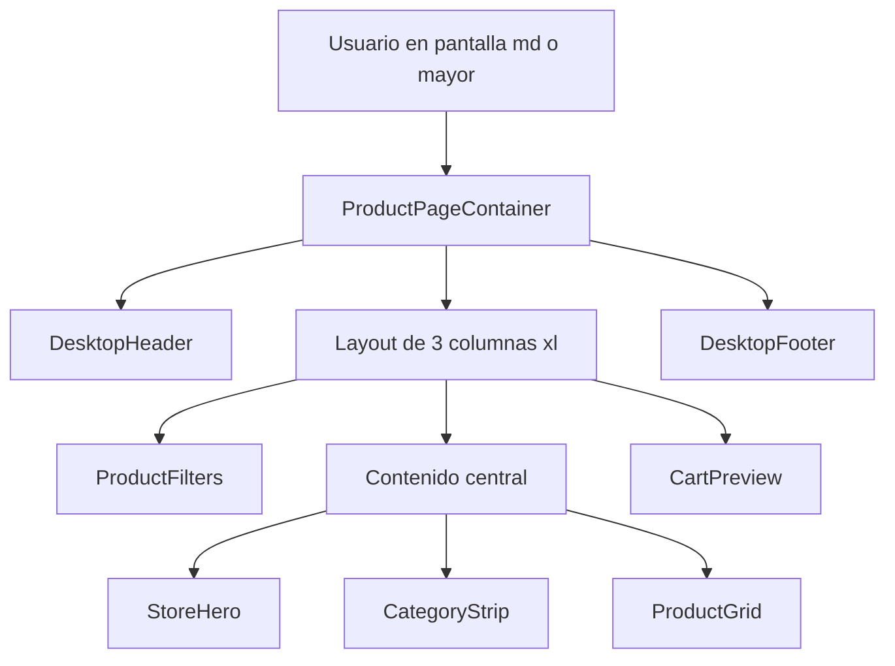
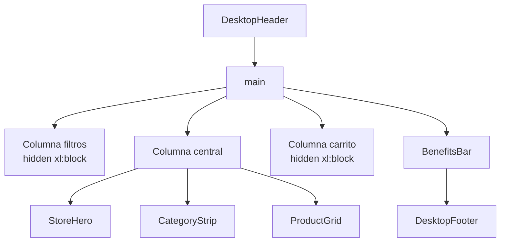
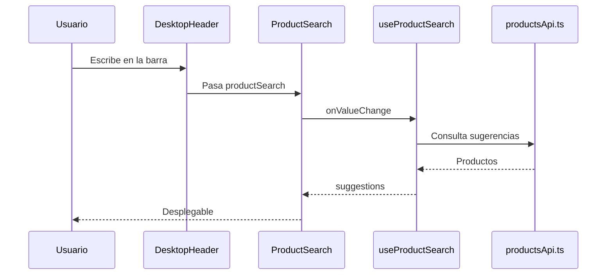

# GUIA TECNICA DE LA PARTE DE ESCRITORIO

## IDEA GENERAL

La parte de escritorio no vive en una app separada. Es la misma aplicacion Next.js, pero con componentes visibles desde breakpoints como `md`, `lg` y `xl`.

## PUNTO DE ENTRADA

| Ruta | Archivo | Resultado |
| --- | --- | --- |
| `/` | `app/page.tsx` | Renderiza `ProductPageContainer`. |
| `/productos` | `app/productos/page.tsx` | Renderiza el mismo `ProductPageContainer`. |

## COMPONENTES CLAVE

| Componente | Archivo | Funcion |
| --- | --- | --- |
| `DesktopHeader` | `components/escritorio/layout/DesktopHeader.tsx` | Header sticky con logo, buscador, cuenta, carrito y tema. |
| `ProductFilters` | `components/compartidos/productos/ProductFilters.tsx` | Filtros laterales visibles en escritorio amplio. |
| `DesktopCategoryGrid` | `components/escritorio/productos/DesktopCategoryGrid.tsx` | Grilla de categorias para pantallas medianas o grandes. |
| `DesktopProductGrid` | `components/escritorio/productos/DesktopProductGrid.tsx` | Grilla densa de productos. |
| `CartPreview` | `components/escritorio/productos/CartPreview.tsx` | Resumen lateral visible en `xl`. |
| `DesktopFooter` | `components/escritorio/layout/DesktopFooter.tsx` | Footer visible desde `md`. |

## ESTRUCTURA VISUAL

## BREAKPOINTS IMPORTANTES

| Clase | Uso |
| --- | --- |
| `hidden md:block` | Oculta en movil y muestra en escritorio/tablet. |
| `hidden md:grid` | Activa grillas desde `md`. |
| `hidden xl:block` | Muestra columnas laterales solo en escritorio amplio. |
| `lg:grid-cols-*` | Mejora distribucion en pantallas grandes. |

## FLUJO DE BUSQUEDA EN ESCRITORIO

## CRITERIO DE MANTENIMIENTO

- Mantener los componentes de escritorio dentro de `components/escritorio/`.
- Reutilizar componentes compartidos desde `components/compartidos/`.
- Evitar mover componentes si solo cambia su contenido interno.
- Mantener Tailwind como fuente del comportamiento responsive.

