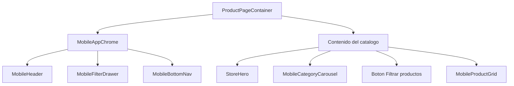
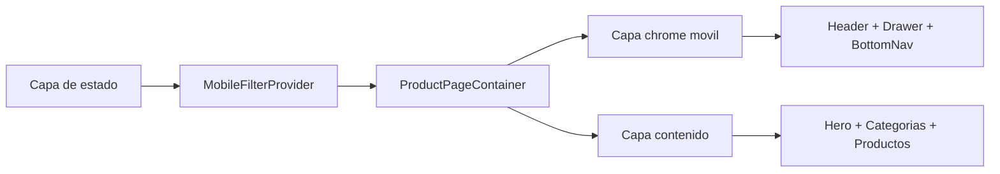
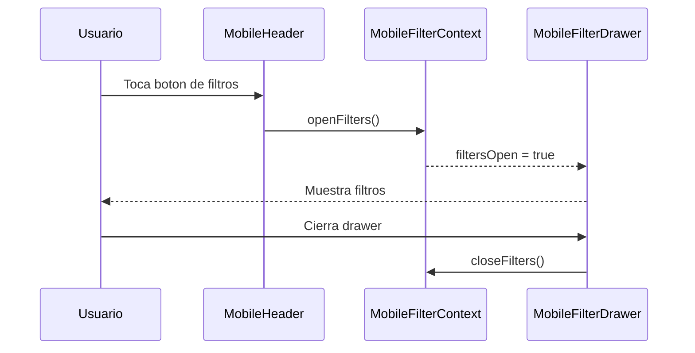
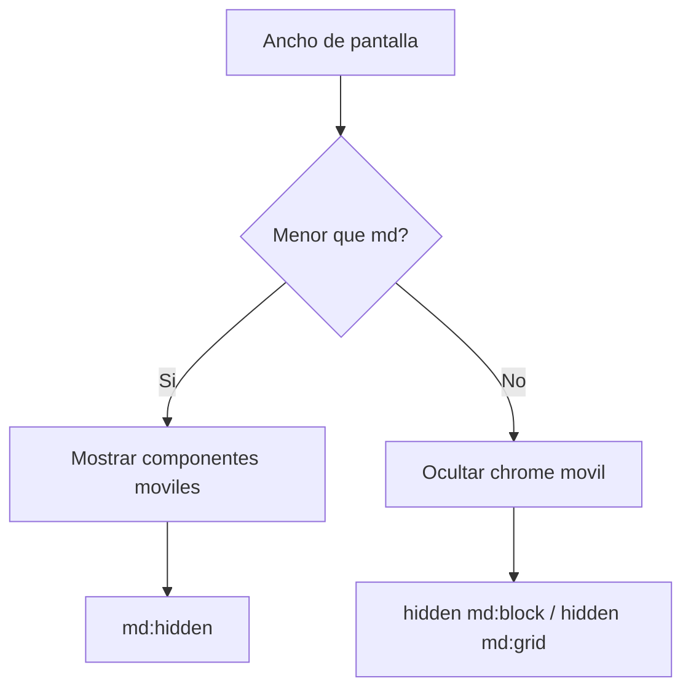

# GUIA TECNICA DE LA PARTE MOVIL

## IDEA GENERAL

La experiencia movil usa la misma app que escritorio. No hay deteccion manual de dispositivo: Tailwind decide que piezas se muestran con clases como `md:hidden`.

## PUNTO DE ENTRADA

| Archivo | Papel |
| --- | --- |
| `app/layout.tsx` | Envuelve la app con `Providers` y `MobileFilterProvider`. |
| `app/page.tsx` | Ruta `/`, renderiza `ProductPageContainer`. |
| `app/productos/page.tsx` | Ruta `/productos`, renderiza el mismo contenedor. |
| `components/compartidos/productos/ProductPageContainer.tsx` | Monta el chrome movil y el contenido. |

## CAPAS DE LA UI MOVIL

## COMPONENTES PRINCIPALES

| Componente | Archivo | Funcion |
| --- | --- | --- |
| `MobileHeader` | `components/movil/layout/MobileHeader.tsx` | Logo, filtros, tema, carrito y busqueda. |
| `MobileFilterDrawer` | `components/movil/productos/MobileFilterDrawer.tsx` | Panel inferior de filtros. |
| `MobileBottomNav` | `components/movil/layout/MobileBottomNav.tsx` | Navegacion inferior fija. |
| `MobileCategoryCarousel` | `components/movil/productos/MobileCategoryCarousel.tsx` | Carrusel horizontal de categorias. |
| `MobileProductGrid` | `components/movil/productos/MobileProductGrid.tsx` | Grilla movil de productos. |
| `MobileProductCard` | `components/movil/productos/MobileProductCard.tsx` | Card tactil de producto. |

## FLUJO DEL DRAWER DE FILTROS

## GRAFICO RESPONSIVE

## CRITERIO DE MANTENIMIENTO

- Los componentes moviles deben quedarse en `components/movil/`.
- La logica compartida debe vivir en hooks o tipos de `features/`.
- Los estilos responsive deben seguir expresados con Tailwind.
- Evitar duplicar logica entre movil y escritorio.

